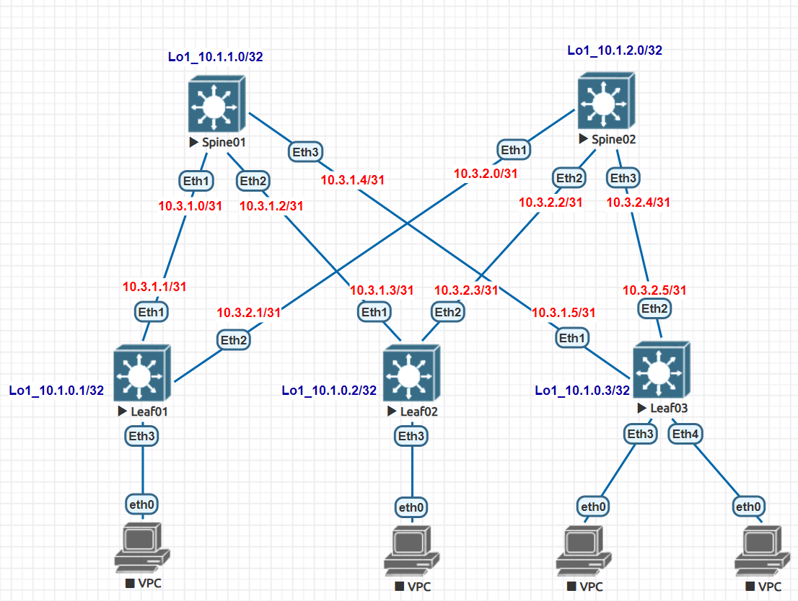

# Домашнее задание №1
## Проектирование адресного пространства

### Задачи:

- Собрать схему CLOS;
- Распределить адресное пространство.

## Выполнение:

### Собранная схема сети




### Таблица адресов

| hostname | interface |   IP/MASK   | Description |
| :------: | :-------: | :----------: | :---------:|
|  Leaf01  | Loopback1 | 10.2.0.1 /32 |            |
|  Leaf01  |   Eth1    | 10.3.1.1 /31 | to_Spine01 |
|  Leaf01  |   Eth2    | 10.3.2.1 /31 | to_Spine02 |
|          |           |              |            |
|  Leaf02  | Loopback1 | 10.2.0.2 /32 |            |
|  Leaf02  |   Eth1    | 10.3.1.3 /31 | to_Spine01 |
|  Leaf02  |   Eth2    | 10.3.2.3 /31 | to_Spine02 |
|          |           |              |            |
|  Leaf03  | Loopback1 | 10.2.0.3 /32 |            |
|  Leaf03  |   Eth1    | 10.3.1.5 /31 | to_Spine01 |
|  Leaf03  |   Eth2    | 10.3.2.5 /31 | to_Spine02 |
|          |           |              |            |
| Spine01  | Loopback1 | 10.1.1.0/32  |            |
| Spine01  |   Eth1    | 10.3.1.0/31  |  to_Leaf01 |
| Spine01  |   Eth2    | 10.3.1.2/31  |  to_Leaf02 |
| Spine01  |   Eth3    | 10.3.1.4/31  |  to_Leaf03 |
|          |           |              |            |
| Spine02  | Loopback1 | 10.1.2.0/32  |            |
| Spine02  |   Eth1    | 10.3.2.0/31  |  to_Leaf01 |
| Spine02  |   Eth2    | 10.3.2.2/31  |  to_Leaf02 |
| Spine02  |   Eth3    | 10.3.2.2/31  |  to_Leaf03 |

### Конфигурация оборудования

- #### [Leaf01](cfg/Leaf01.conf)

```
Leaf01(config)#interface Ethernet 1
Leaf01(config-if-Et1)#no switchport
Leaf01(config-if-Et1)#ip address 10.3.1.1/31
Leaf01(config-if-Et1)#description to_Spine01
Leaf01(config-if-Et1)#interface Ethernet 2
Leaf01(config-if-Et2)#ip address 10.3.2.1/31
! IP configuration will be ignored while interface Ethernet2 is not a routed po.
Leaf01(config-if-Et2)#no switchport
Leaf01(config-if-Et2)#description to_Spine02
Leaf01(config-if-Et2)#exit
Leaf01(config)#interface Loopback 1
Leaf01(config-if-Lo1)#ip address 10.1.0.1/32
```

- #### [Leaf02](cfg/Leaf02.conf)

```
Leaf02(config)#interface Ethernet 1
Leaf02(config-if-Et1)#no switchport
Leaf02(config-if-Et1)#description to_Spine01
Leaf02(config-if-Et1)#ip address 10.3.1.3/31
Leaf02(config-if-Et1)#exit
Leaf02(config)#interface Ethernet 2
Leaf02(config-if-Et2)#description to_Spine02
Leaf02(config-if-Et2)#no switchport
Leaf02(config-if-Et2)#ip address 10.3.2.3/31
Leaf02(config-if-Et2)#exit
Leaf02(config)#interface Loopback 1
Leaf02(config-if-Lo1)#ip address 10.1.0.2/32

```

- #### [Leaf03](cfg/Leaf03.conf)

```
Leaf03(config)#interface Ethernet 1
Leaf03(config-if-Et1)#no switchport
Leaf03(config-if-Et1)#description to_Spine01
Leaf03(config-if-Et1)#ip address 10.3.1.5/31
Leaf03(config-if-Et1)#exit
Leaf03(config)#interface Ethernet 2
Leaf03(config-if-Et2)#no switchport
Leaf03(config-if-Et2)#description to_Spine02
Leaf03(config-if-Et2)#ip address 10.3.2.5/31
Leaf03(config-if-Et2)#exit
Leaf03(config)#interface Loopback 1
Leaf03(config-if-Lo1)#ip address 10.1.0.3/32
```

- #### [Spine01](cfg/Spine01.conf)

```
Spine01(config)#interface Loopback 1
Spine01(config-if-Lo1)#ip address 10.1.1.0/32
Spine01(config-if-Lo1)#exit
Spine01(config)#interface Ethernet 1
Spine01(config-if-Et1)#no switchport
Spine01(config-if-Et1)#description to_Leaf01
Spine01(config-if-Et1)#ip address 10.3.1.0/31
Spine01(config-if-Et1)#interface Ethernet 2
Spine01(config-if-Et2)#no switchport
Spine01(config-if-Et2)#description to_Leaf02
Spine01(config-if-Et2)#ip address 10.3.1.2/31
Spine01(config-if-Et2)#interface Ethernet 3
Spine01(config-if-Et3)#ip address 10.3.1.4/31
! IP configuration will be ignored while interface Ethernet3 is not a routed po.
Spine01(config-if-Et3)#no switchport
Spine01(config-if-Et3)#description to_Leaf03

```

- #### [Spine02](cfg/Spine02.conf)

```
Spine02(config)#interface Loopback 1
Spine02(config-if-Lo1)#ip address 10.1.2.0/32
Spine02(config-if-Lo1)#exit
Spine02(config)#interface Ethernet 1
Spine02(config-if-Et1)#no switchport
Spine02(config-if-Et1)#description to_Leaf01
Spine02(config-if-Et1)#ip address 10.3.2.0/31
Spine02(config-if-Et1)#exit
Spine02(config)#interface Ethernet 2
Spine02(config-if-Et2)#no switchport
Spine02(config-if-Et2)#description to_Leaf02
Spine02(config-if-Et2)#ip address 10.3.2.2/31
Spine02(config-if-Et2)#exit
Spine02(config)#interface Ethernet 3
Spine02(config-if-Et3)#no switchport
Spine02(config-if-Et3)#ip address 10.3.2.4/31
Spine02(config-if-Et3)#exit
```

### Проверка доступности

- #### Spine01

~~~
Spine01#ping 10.3.1.1
PING 10.3.1.1 (10.3.1.1) 72(100) bytes of data.
80 bytes from 10.3.1.1: icmp_seq=1 ttl=64 time=7.65 ms
80 bytes from 10.3.1.1: icmp_seq=2 ttl=64 time=2.38 ms
80 bytes from 10.3.1.1: icmp_seq=3 ttl=64 time=2.87 ms
80 bytes from 10.3.1.1: icmp_seq=4 ttl=64 time=2.50 ms
80 bytes from 10.3.1.1: icmp_seq=5 ttl=64 time=2.44 ms

--- 10.3.1.1 ping statistics ---
5 packets transmitted, 5 received, 0% packet loss, time 27ms
rtt min/avg/max/mdev = 2.387/3.571/7.650/2.046 ms, ipg/ewma 6.983/5.538 ms
Spine01#ping 10.3.1.3
PING 10.3.1.3 (10.3.1.3) 72(100) bytes of data.
80 bytes from 10.3.1.3: icmp_seq=1 ttl=64 time=5.62 ms
80 bytes from 10.3.1.3: icmp_seq=2 ttl=64 time=2.27 ms
80 bytes from 10.3.1.3: icmp_seq=3 ttl=64 time=2.36 ms
80 bytes from 10.3.1.3: icmp_seq=4 ttl=64 time=2.34 ms
80 bytes from 10.3.1.3: icmp_seq=5 ttl=64 time=2.55 ms

--- 10.3.1.3 ping statistics ---
5 packets transmitted, 5 received, 0% packet loss, time 22ms
rtt min/avg/max/mdev = 2.278/3.031/5.625/1.301 ms, ipg/ewma 5.500/4.289 ms
Spine01#ping 10.3.1.5
PING 10.3.1.5 (10.3.1.5) 72(100) bytes of data.
80 bytes from 10.3.1.5: icmp_seq=1 ttl=64 time=3.32 ms
80 bytes from 10.3.1.5: icmp_seq=2 ttl=64 time=2.34 ms
80 bytes from 10.3.1.5: icmp_seq=3 ttl=64 time=2.30 ms
80 bytes from 10.3.1.5: icmp_seq=4 ttl=64 time=2.30 ms
80 bytes from 10.3.1.5: icmp_seq=5 ttl=64 time=2.28 ms

--- 10.3.1.5 ping statistics ---
5 packets transmitted, 5 received, 0% packet loss, time 15ms
rtt min/avg/max/mdev = 2.286/2.513/3.320/0.405 ms, ipg/ewma 3.801/2.901 ms
Spine01#
~~~

- #### Spine02

~~~
Spine02#ping 10.3.2.1
PING 10.3.2.1 (10.3.2.1) 72(100) bytes of data.
80 bytes from 10.3.2.1: icmp_seq=1 ttl=64 time=5.61 ms
80 bytes from 10.3.2.1: icmp_seq=2 ttl=64 time=2.41 ms
80 bytes from 10.3.2.1: icmp_seq=3 ttl=64 time=2.56 ms
80 bytes from 10.3.2.1: icmp_seq=4 ttl=64 time=2.26 ms
80 bytes from 10.3.2.1: icmp_seq=5 ttl=64 time=2.23 ms

--- 10.3.2.1 ping statistics ---
5 packets transmitted, 5 received, 0% packet loss, time 22ms
rtt min/avg/max/mdev = 2.239/3.018/5.617/1.305 ms, ipg/ewma 5.504/4.267 ms
Spine02#ping 10.3.2.3
PING 10.3.2.3 (10.3.2.3) 72(100) bytes of data.
80 bytes from 10.3.2.3: icmp_seq=1 ttl=64 time=20.4 ms
80 bytes from 10.3.2.3: icmp_seq=2 ttl=64 time=3.97 ms
80 bytes from 10.3.2.3: icmp_seq=3 ttl=64 time=2.87 ms
80 bytes from 10.3.2.3: icmp_seq=4 ttl=64 time=2.59 ms
80 bytes from 10.3.2.3: icmp_seq=5 ttl=64 time=3.51 ms

--- 10.3.2.3 ping statistics ---
5 packets transmitted, 5 received, 0% packet loss, time 69ms
rtt min/avg/max/mdev = 2.596/6.682/20.453/6.902 ms, pipe 2, ipg/ewma 17.444/13.32s
Spine02#ping 10.3.2.5
PING 10.3.2.5 (10.3.2.5) 72(100) bytes of data.
80 bytes from 10.3.2.5: icmp_seq=1 ttl=64 time=4.53 ms
80 bytes from 10.3.2.5: icmp_seq=2 ttl=64 time=2.80 ms
80 bytes from 10.3.2.5: icmp_seq=3 ttl=64 time=2.81 ms
80 bytes from 10.3.2.5: icmp_seq=4 ttl=64 time=2.96 ms
80 bytes from 10.3.2.5: icmp_seq=5 ttl=64 time=3.14 ms

--- 10.3.2.5 ping statistics ---
5 packets transmitted, 5 received, 0% packet loss, time 18ms
rtt min/avg/max/mdev = 2.808/3.252/4.532/0.651 ms, ipg/ewma 4.617/3.878 ms
~~~
