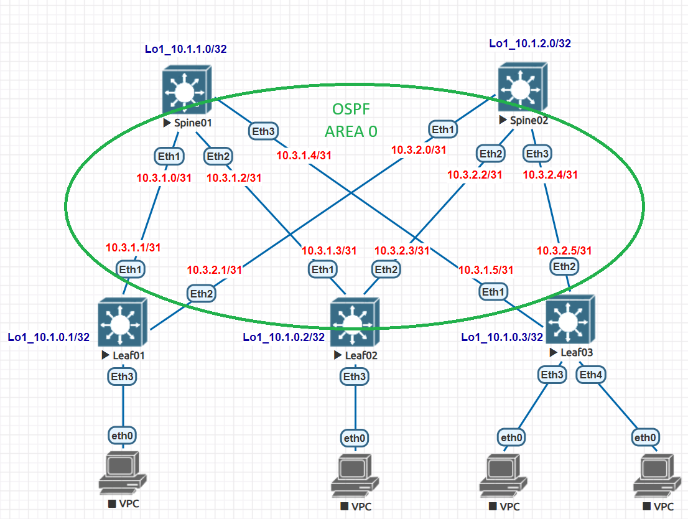

# Домашнее задание №2
## Underlay. OSPF

### Задача:

- Настроить протокол OSPF для Underlay сети
- Проверить связанность между устройствами

## Выполнение:

### Схема сети




### Конфигурация оборудования

- #### [Leaf01](cfg/Leaf01.conf)

```
interface Ethernet1
description to_Spine01
no switchport
ip address 10.3.1.1/31
ip ospf network point-to-point
ip ospf area 0.0.0.0

interface Ethernet2
description to_Spine02
no switchport
ip address 10.3.2.1/31
ip ospf network point-to-point
ip ospf area 0.0.0.0

interface Ethernet3

interface Loopback1
ip address 10.1.0.1/32
ip ospf area 0.0.0.0

router ospf 1
router-id 10.1.0.1
passive-interface Loopback1

```

- #### [Leaf02](cfg/Leaf02.conf)

```
interface Ethernet1
description to_Spine01
no switchport
ip address 10.3.1.3/31
ip ospf network point-to-point
ip ospf area 0.0.0.0

interface Ethernet2
description to_Spine02
no switchport
ip address 10.3.2.3/31
ip ospf network point-to-point
ip ospf area 0.0.0.0

interface Ethernet3

interface Loopback1
ip address 10.1.0.2/32
ip ospf area 0.0.0.0

router ospf 1
router-id 10.1.0.2
passive-interface Loopback1

```

- #### [Leaf03](cfg/Leaf03.conf)

```
interface Ethernet1
description to_Spine01
no switchport
ip address 10.3.1.5/31
ip ospf network point-to-point
ip ospf area 0.0.0.0

interface Ethernet2
description to_Spine02
no switchport
ip address 10.3.2.5/31
ip ospf network point-to-point
ip ospf area 0.0.0.0

interface Ethernet3

interface Loopback1
ip address 10.1.0.3/32
ip ospf area 0.0.0.0

router ospf 1
router-id 10.1.0.3
passive-interface Loopback1

```

- #### [Spine01](cfg/Spine01.conf)

```
interface Ethernet1
description to_Leaf01
no switchport
ip address 10.3.1.0/31
ip ospf network point-to-point
ip ospf area 0.0.0.0
!
interface Ethernet2
description to_Leaf02
no switchport
ip address 10.3.1.2/31
ip ospf network point-to-point
ip ospf area 0.0.0.0
!
interface Ethernet3
description to_Leaf03
no switchport
ip address 10.3.1.4/31
ip ospf network point-to-point
ip ospf area 0.0.0.0

interface Loopback1
ip address 10.1.1.0/32
ip ospf area 0.0.0.0

router ospf 1
router-id 10.1.1.0
passive-interface Loopback1

```

- #### [Spine02](cfg/Spine02.conf)

```
interface Ethernet1
description to_Leaf01
no switchport
ip address 10.3.2.0/31
ip ospf network point-to-point
ip ospf area 0.0.0.0

interface Ethernet2
description to_Leaf02
no switchport
ip address 10.3.2.2/31
ip ospf network point-to-point
ip ospf area 0.0.0.0

interface Ethernet3
description to_Leaf03
no switchport
ip address 10.3.2.4/31
ip ospf network point-to-point
ip ospf area 0.0.0.0

interface Loopback1
ip address 10.1.2.0/32
ip ospf area 0.0.0.0

router ospf 1
router-id 10.1.2.0
passive-interface Loopback1

```
---
### Проверка связанности устройств по протоколу OSPF

- #### Spine01

```
Spine01#show ip ospf neighbor
Neighbor ID     Instance VRF      Pri State                  Dead Time   Address         Interface
10.1.0.1        1        default  0   FULL                   00:00:29    10.3.1.1        Ethernet1
10.1.0.2        1        default  0   FULL                   00:00:33    10.3.1.3        Ethernet2
10.1.0.3        1        default  0   FULL                   00:00:35    10.3.1.5        Ethernet3
```

- #### Spine02

```
Spine02#show ip ospf neighbor
Neighbor ID     Instance VRF      Pri State                  Dead Time   Address         Interface
10.1.0.1        1        default  0   FULL                   00:00:37    10.3.2.1        Ethernet1
10.1.0.2        1        default  0   FULL                   00:00:35    10.3.2.3        Ethernet2
10.1.0.3        1        default  0   FULL                   00:00:34    10.3.2.5        Ethernet3
```
