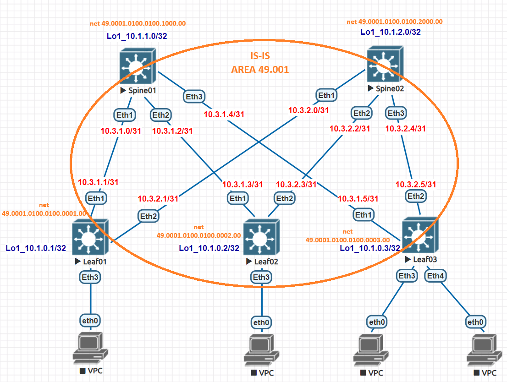

# Домашнее задание №3

## Underlay. IS-IS

### Задача:

- Настроить протокол IS-IS для Underlay сети
- Проверить связанность между устройствами

## Выполнение:

### Схема сети



### Конфигурация оборудования

- #### [Leaf01](cfg/Leaf01.conf)

```
interface Ethernet1
description to_Spine01
no switchport
ip address 10.3.1.1/31
isis enable underlayer
isis circuit-type level-1
isis network point-to-point

interface Ethernet2
description to_Spine02
no switchport
ip address 10.3.2.1/31
isis enable underlayer
isis circuit-type level-1
isis network point-to-point

interface Loopback1
ip address 10.1.0.1/32
isis enable underlayer
isis passive

router isis underlayer
net 49.0001.0100.0100.0001.00
is-type level-1
address-family ipv4 unicast


```

- #### [Leaf02](cfg/Leaf02.conf)

```
interface Ethernet1
description to_Spine01
no switchport
ip address 10.3.1.3/31
isis enable underlayer
isis circuit-type level-1
isis network point-to-point

interface Ethernet2
description to_Spine02
no switchport
ip address 10.3.2.3/31
isis enable underlayer
isis circuit-type level-1
isis network point-to-point

interface Loopback1
ip address 10.1.0.2/32
isis enable underlayer
isis passive

router isis underlayer
net 49.0001.0100.0100.0002.00
is-type level-1
address-family ipv4 unicast
```

- #### [Leaf03](cfg/Leaf03.conf)

```
interface Ethernet1
description to_Spine01
no switchport
ip address 10.3.1.5/31
isis enable underlayer
isis circuit-type level-1
isis network point-to-point

interface Ethernet2
description to_Spine02
no switchport
ip address 10.3.2.5/31
isis enable underlayer
isis circuit-type level-1
isis network point-to-point

interface Loopback1
ip address 10.1.0.3/32
isis enable underlayer
isis passive

router isis underlayer
net 49.0001.0100.0100.0003.00
is-type level-1
address-family ipv4 unicast
```

- #### [Spine01](cfg/Spine01.conf)

```
interface Ethernet1
description to_Leaf01
no switchport
ip address 10.3.1.0/31
isis enable underlayer
isis circuit-type level-1
isis network point-to-point

interface Ethernet2
description to_Leaf02
no switchport
ip address 10.3.1.2/31
isis enable underlayer
isis circuit-type level-1
isis network point-to-point

interface Ethernet3
description to_Leaf03
no switchport
ip address 10.3.1.4/31
isis enable underlayer
isis circuit-type level-1
isis network point-to-point

interface Loopback1
ip address 10.1.1.0/32
isis enable underlayer
isis passive

router isis underlayer
net 49.0001.0100.0100.1000.00
is-type level-1
address-family ipv4 unicast

```

- #### [Spine02](cfg/Spine02.conf)

```
interface Ethernet1
description to_Leaf01
no switchport
ip address 10.3.2.0/31
isis enable underlayer
isis circuit-type level-1
isis network point-to-point

interface Ethernet2
description to_Leaf02
no switchport
ip address 10.3.2.2/31
isis enable underlayer
isis circuit-type level-1
isis network point-to-point

interface Ethernet3
description to_Leaf03
no switchport
ip address 10.3.2.4/31
isis enable underlayer
isis circuit-type level-1
isis network point-to-point

interface Loopback1
ip address 10.1.2.0/32
isis enable underlayer
isis passive

router isis underlayer
net 49.0001.0100.0100.2000.00
is-type level-1
address-family ipv4 unicast

```

---

### Проверка связанности устройств по протоколу IS-IS

- #### Spine01 

```
Spine01#show isis neighbors

Instance  VRF      System Id        Type Interface          SNPA              State Hold time   Circuit Id
underlaye default  Leaf01           L1   Ethernet1          P2P               UP    27          09
underlaye default  Leaf02           L1   Ethernet2          P2P               UP    25          09
underlaye default  Leaf03           L1   Ethernet3          P2P               UP    27          0B


Spine01#show ip route

VRF: default
Codes: C - connected, S - static, K - kernel,
       O - OSPF, IA - OSPF inter area, E1 - OSPF external type 1,
       E2 - OSPF external type 2, N1 - OSPF NSSA external type 1,
       N2 - OSPF NSSA external type2, B - Other BGP Routes,
       B I - iBGP, B E - eBGP, R - RIP, I L1 - IS-IS level 1,
       I L2 - IS-IS level 2, O3 - OSPFv3, A B - BGP Aggregate,
       A O - OSPF Summary, NG - Nexthop Group Static Route,
       V - VXLAN Control Service, M - Martian,
       DH - DHCP client installed default route,
       DP - Dynamic Policy Route, L - VRF Leaked,
       G  - gRIBI, RC - Route Cache Route

Gateway of last resort is not set

 I L1     10.1.0.1/32 [115/20] via 10.3.1.1, Ethernet1
 I L1     10.1.0.2/32 [115/20] via 10.3.1.3, Ethernet2
 I L1     10.1.0.3/32 [115/20] via 10.3.1.5, Ethernet3
 C        10.1.1.0/32 is directly connected, Loopback1
 I L1     10.1.2.0/32 [115/30] via 10.3.1.1, Ethernet1
                               via 10.3.1.3, Ethernet2
                               via 10.3.1.5, Ethernet3
 C        10.3.1.0/31 is directly connected, Ethernet1
 C        10.3.1.2/31 is directly connected, Ethernet2
 C        10.3.1.4/31 is directly connected, Ethernet3
 I L1     10.3.2.0/31 [115/20] via 10.3.1.1, Ethernet1
 I L1     10.3.2.2/31 [115/20] via 10.3.1.3, Ethernet2
 I L1     10.3.2.4/31 [115/20] via 10.3.1.5, Ethernet3

```

- #### Spine02

```
Spine02#show isis neighbors

Instance  VRF      System Id        Type Interface          SNPA              State Hold time   Circuit Id
underlaye default  Leaf01           L1   Ethernet1          P2P               UP    21          0A
underlaye default  Leaf02           L1   Ethernet2          P2P               UP    25          0A
underlaye default  Leaf03           L1   Ethernet3          P2P               UP    26          0C

Spine02#show ip route

VRF: default
Codes: C - connected, S - static, K - kernel,
       O - OSPF, IA - OSPF inter area, E1 - OSPF external type 1,
       E2 - OSPF external type 2, N1 - OSPF NSSA external type 1,
       N2 - OSPF NSSA external type2, B - Other BGP Routes,
       B I - iBGP, B E - eBGP, R - RIP, I L1 - IS-IS level 1,
       I L2 - IS-IS level 2, O3 - OSPFv3, A B - BGP Aggregate,
       A O - OSPF Summary, NG - Nexthop Group Static Route,
       V - VXLAN Control Service, M - Martian,
       DH - DHCP client installed default route,
       DP - Dynamic Policy Route, L - VRF Leaked,
       G  - gRIBI, RC - Route Cache Route

Gateway of last resort is not set

 I L1     10.1.0.1/32 [115/20] via 10.3.2.1, Ethernet1
 I L1     10.1.0.2/32 [115/20] via 10.3.2.3, Ethernet2
 I L1     10.1.0.3/32 [115/20] via 10.3.2.5, Ethernet3
 I L1     10.1.1.0/32 [115/30] via 10.3.2.1, Ethernet1
                               via 10.3.2.3, Ethernet2
                               via 10.3.2.5, Ethernet3
 C        10.1.2.0/32 is directly connected, Loopback1
 I L1     10.3.1.0/31 [115/20] via 10.3.2.1, Ethernet1
 I L1     10.3.1.2/31 [115/20] via 10.3.2.3, Ethernet2
 I L1     10.3.1.4/31 [115/20] via 10.3.2.5, Ethernet3
 C        10.3.2.0/31 is directly connected, Ethernet1
 C        10.3.2.2/31 is directly connected, Ethernet2
 C        10.3.2.4/31 is directly connected, Ethernet3
```
