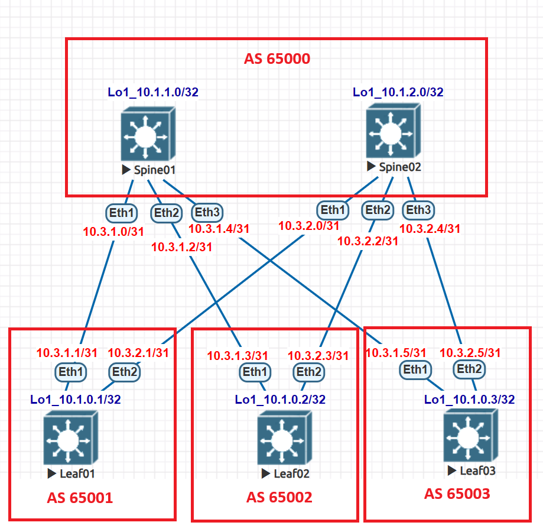

# Домашнее задание №4

## Underlay. eBGP

### Задача:

- Настроить протокол eBGP для Underlay сети
- Проверить связанность между устройствами

## Выполнение:

### Схема сети



### Конфигурация оборудования

- #### [Leaf01](cfg/Leaf01.conf)

```
router bgp 65001
router-id 10.1.0.1
timers bgp 3 9
maximum-paths 10 ecmp 10
neighbor SPINE peer group
neighbor SPINE remote-as 65000
neighbor SPINE bfd
neighbor SPINE allowas-in 1
neighbor 10.3.1.0 peer group SPINE
neighbor 10.3.2.0 peer group SPINE
network 10.1.0.1/32
```

- #### [Leaf02](cfg/Leaf02.conf)

```
router bgp 65002
router-id 10.1.0.2
timers bgp 3 9
maximum-paths 10 ecmp 10
neighbor SPINE peer group
neighbor SPINE remote-as 65000
neighbor SPINE bfd
neighbor SPINE allowas-in 1
neighbor 10.3.1.2 peer group SPINE
neighbor 10.3.2.2 peer group SPINE
network 10.1.0.2/32
```

- #### [Leaf03](cfg/Leaf03.conf)

```
router bgp 65003
router-id 10.1.0.3
timers bgp 3 9
maximum-paths 10 ecmp 10
neighbor SPINE peer group
neighbor SPINE remote-as 65000
neighbor SPINE bfd
neighbor SPINE allowas-in 1
neighbor 10.3.1.4 peer group SPINE
neighbor 10.3.2.4 peer group SPINE
network 10.1.0.3/32
```

- #### [Spine01](cfg/Spine01.conf)

```
peer-filter LEAF
10 match as-range 65001-65003 result accept
exit

router bgp 65000
router-id 10.1.1.0
timers bgp 3 9
maximum-paths 10 ecmp 10
bgp listen range 10.3.1.0/24 peer-group LEAF peer-filter LEAF
neighbor LEAF peer group
neighbor LEAF bfd
network 10.1.1.0/32
```

- #### [Spine02](cfg/Spine02.conf)

```
peer-filter LEAF
10 match as-range 65001-65003 result accept
exit

router bgp 65000
router-id 10.1.2.0
timers bgp 3 9
maximum-paths 10 ecmp 10
bgp listen range 10.3.2.0/24 peer-group LEAF peer-filter LEAF
neighbor LEAF peer group
neighbor LEAF bfd
network 10.1.2.0/32
```

---

### Проверка связанности устройств по протоколу BGP

- #### Spine01

```
Spine01#show bgp summary
BGP summary information for VRF default
Router identifier 10.1.1.0, local AS number 65000
Neighbor          AS Session State AFI/SAFI                AFI/SAFI State   NLRI Rcd   NLRI Acc
-------- ----------- ------------- ----------------------- -------------- ---------- ----------
10.3.1.1       65001 Established   IPv4 Unicast            Negotiated              1          1
10.3.1.3       65002 Established   IPv4 Unicast            Negotiated              1          1
10.3.1.5       65003 Established   IPv4 Unicast            Negotiated              1          1

```
```
Spine01#show bfd peers
VRF name: default
-----------------
DstAddr       MyDisc    YourDisc  Interface/Transport    Type           LastUp
--------- ----------- ----------- -------------------- ------- ----------------
10.3.1.1   861361918  4271140443         Ethernet1(9)  normal   06/17/24 21:22
10.3.1.3  1561357743     3453575        Ethernet2(10)  normal   06/17/24 21:22
10.3.1.5  2504613647  3915094004        Ethernet3(11)  normal   06/17/24 21:22

   LastDown            LastDiag    State
-------------- ------------------- -----
         NA       No Diagnostic       Up
         NA       No Diagnostic       Up
         NA       No Diagnostic       Up
```
```
Spine01#show ip route

VRF: default
Codes: C - connected, S - static, K - kernel,
       O - OSPF, IA - OSPF inter area, E1 - OSPF external type 1,
       E2 - OSPF external type 2, N1 - OSPF NSSA external type 1,
       N2 - OSPF NSSA external type2, B - Other BGP Routes,
       B I - iBGP, B E - eBGP, R - RIP, I L1 - IS-IS level 1,
       I L2 - IS-IS level 2, O3 - OSPFv3, A B - BGP Aggregate,
       A O - OSPF Summary, NG - Nexthop Group Static Route,
       V - VXLAN Control Service, M - Martian,
       DH - DHCP client installed default route,
       DP - Dynamic Policy Route, L - VRF Leaked,
       G  - gRIBI, RC - Route Cache Route

Gateway of last resort is not set

 B E      10.1.0.1/32 [200/0] via 10.3.1.1, Ethernet1
 B E      10.1.0.2/32 [200/0] via 10.3.1.3, Ethernet2
 B E      10.1.0.3/32 [200/0] via 10.3.1.5, Ethernet3
 C        10.1.1.0/32 is directly connected, Loopback1
 C        10.3.1.0/31 is directly connected, Ethernet1
 C        10.3.1.2/31 is directly connected, Ethernet2
 C        10.3.1.4/31 is directly connected, Ethernet3

```


- #### Spine02

```
Spine02#show bgp summary
BGP summary information for VRF default
Router identifier 10.1.2.0, local AS number 65000
Neighbor          AS Session State AFI/SAFI                AFI/SAFI State   NLRI Rcd   NLRI Acc
-------- ----------- ------------- ----------------------- -------------- ---------- ----------
10.3.2.1       65001 Established   IPv4 Unicast            Negotiated              1          1
10.3.2.3       65002 Established   IPv4 Unicast            Negotiated              1          1
10.3.2.5       65003 Established   IPv4 Unicast            Negotiated              1          1

```
```
Spine02#show bfd peers
VRF name: default
-----------------
DstAddr       MyDisc    YourDisc  Interface/Transport    Type           LastUp
--------- ----------- ----------- -------------------- ------- ----------------
10.3.2.1  2401933499  4070870588        Ethernet1(14)  normal   06/17/24 21:14
10.3.2.3  1714037241  2509128711        Ethernet2(15)  normal   06/17/24 21:14
10.3.2.5  1426143212  3409037206        Ethernet3(16)  normal   06/17/24 21:14

   LastDown            LastDiag    State
-------------- ------------------- -----
         NA       No Diagnostic       Up
         NA       No Diagnostic       Up
         NA       No Diagnostic       Up

```
```
Spine02#show ip route

VRF: default
Codes: C - connected, S - static, K - kernel,
       O - OSPF, IA - OSPF inter area, E1 - OSPF external type 1,
       E2 - OSPF external type 2, N1 - OSPF NSSA external type 1,
       N2 - OSPF NSSA external type2, B - Other BGP Routes,
       B I - iBGP, B E - eBGP, R - RIP, I L1 - IS-IS level 1,
       I L2 - IS-IS level 2, O3 - OSPFv3, A B - BGP Aggregate,
       A O - OSPF Summary, NG - Nexthop Group Static Route,
       V - VXLAN Control Service, M - Martian,
       DH - DHCP client installed default route,
       DP - Dynamic Policy Route, L - VRF Leaked,
       G  - gRIBI, RC - Route Cache Route

Gateway of last resort is not set

 B E      10.1.0.1/32 [200/0] via 10.3.2.1, Ethernet1
 B E      10.1.0.2/32 [200/0] via 10.3.2.3, Ethernet2
 B E      10.1.0.3/32 [200/0] via 10.3.2.5, Ethernet3
 C        10.1.2.0/32 is directly connected, Loopback1
 C        10.3.2.0/31 is directly connected, Ethernet1
 C        10.3.2.2/31 is directly connected, Ethernet2
 C        10.3.2.4/31 is directly connected, Ethernet3

```

- #### Leaf01

```
Leaf01#show bgp summary
BGP summary information for VRF default
Router identifier 10.1.0.1, local AS number 65001
Neighbor          AS Session State AFI/SAFI                AFI/SAFI State   NLRI Rcd   NLRI Acc
-------- ----------- ------------- ----------------------- -------------- ---------- ----------
10.3.1.0       65000 Established   IPv4 Unicast            Negotiated              3          3
10.3.2.0       65000 Established   IPv4 Unicast            Negotiated              3          3
```

```
Leaf01#show bfd peers
VRF name: default
-----------------
DstAddr       MyDisc    YourDisc  Interface/Transport    Type           LastUp
--------- ----------- ----------- -------------------- ------- ----------------
10.3.1.0  4271140443   861361918         Ethernet1(9)  normal   06/17/24 21:22
10.3.2.0  4070870588  2401933499        Ethernet2(10)  normal   06/17/24 21:14

         LastDown            LastDiag    State
-------------------- ------------------- -----
   06/17/24 21:22       No Diagnostic       Up
               NA       No Diagnostic       Up

```
```
Leaf01#show ip route

VRF: default
Codes: C - connected, S - static, K - kernel,
       O - OSPF, IA - OSPF inter area, E1 - OSPF external type 1,
       E2 - OSPF external type 2, N1 - OSPF NSSA external type 1,
       N2 - OSPF NSSA external type2, B - Other BGP Routes,
       B I - iBGP, B E - eBGP, R - RIP, I L1 - IS-IS level 1,
       I L2 - IS-IS level 2, O3 - OSPFv3, A B - BGP Aggregate,
       A O - OSPF Summary, NG - Nexthop Group Static Route,
       V - VXLAN Control Service, M - Martian,
       DH - DHCP client installed default route,
       DP - Dynamic Policy Route, L - VRF Leaked,
       G  - gRIBI, RC - Route Cache Route

Gateway of last resort is not set

 C        10.1.0.1/32 is directly connected, Loopback1
 B E      10.1.0.2/32 [200/0] via 10.3.1.0, Ethernet1
                              via 10.3.2.0, Ethernet2
 B E      10.1.0.3/32 [200/0] via 10.3.1.0, Ethernet1
                              via 10.3.2.0, Ethernet2
 B E      10.1.1.0/32 [200/0] via 10.3.1.0, Ethernet1
 B E      10.1.2.0/32 [200/0] via 10.3.2.0, Ethernet2
 C        10.3.1.0/31 is directly connected, Ethernet1
 C        10.3.2.0/31 is directly connected, Ethernet2

```
```
Leaf01#ping 10.1.0.2 source 10.1.0.1
PING 10.1.0.2 (10.1.0.2) from 10.1.0.1 : 72(100) bytes of data.
80 bytes from 10.1.0.2: icmp_seq=1 ttl=63 time=7.79 ms
80 bytes from 10.1.0.2: icmp_seq=2 ttl=63 time=4.37 ms
80 bytes from 10.1.0.2: icmp_seq=3 ttl=63 time=4.74 ms
80 bytes from 10.1.0.2: icmp_seq=4 ttl=63 time=4.27 ms
80 bytes from 10.1.0.2: icmp_seq=5 ttl=63 time=4.65 ms

--- 10.1.0.2 ping statistics ---
5 packets transmitted, 5 received, 0% packet loss, time 29ms
rtt min/avg/max/mdev = 4.270/5.167/7.791/1.324 ms, ipg/ewma 7.454/6.436 ms
Leaf01#ping 10.1.0.3 source 10.1.0.1
PING 10.1.0.3 (10.1.0.3) from 10.1.0.1 : 72(100) bytes of data.
80 bytes from 10.1.0.3: icmp_seq=1 ttl=63 time=7.34 ms
80 bytes from 10.1.0.3: icmp_seq=2 ttl=63 time=4.90 ms
80 bytes from 10.1.0.3: icmp_seq=3 ttl=63 time=4.95 ms
80 bytes from 10.1.0.3: icmp_seq=4 ttl=63 time=4.57 ms
80 bytes from 10.1.0.3: icmp_seq=5 ttl=63 time=4.55 ms

--- 10.1.0.3 ping statistics ---
5 packets transmitted, 5 received, 0% packet loss, time 29ms
rtt min/avg/max/mdev = 4.556/5.266/7.342/1.054 ms, ipg/ewma 7.354/6.258 ms

```


- #### Leaf02

```
Leaf02#show bgp summary
BGP summary information for VRF default
Router identifier 10.1.0.2, local AS number 65002
Neighbor          AS Session State AFI/SAFI                AFI/SAFI State   NLRI Rcd   NLRI Acc
-------- ----------- ------------- ----------------------- -------------- ---------- ----------
10.3.1.2       65000 Established   IPv4 Unicast            Negotiated              3          3
10.3.2.2       65000 Established   IPv4 Unicast            Negotiated              3          3
```
```
Leaf02#show bfd peers
VRF name: default
-----------------
DstAddr       MyDisc    YourDisc  Interface/Transport    Type           LastUp
--------- ----------- ----------- -------------------- ------- ----------------
10.3.1.2     3453575  1561357743         Ethernet1(9)  normal   06/17/24 21:22
10.3.2.2  2509128711  1714037241        Ethernet2(10)  normal   06/17/24 21:14

         LastDown            LastDiag    State
-------------------- ------------------- -----
   06/17/24 21:22       No Diagnostic       Up
               NA       No Diagnostic       Up
```
```
Leaf02#show ip route

VRF: default
Codes: C - connected, S - static, K - kernel,
       O - OSPF, IA - OSPF inter area, E1 - OSPF external type 1,
       E2 - OSPF external type 2, N1 - OSPF NSSA external type 1,
       N2 - OSPF NSSA external type2, B - Other BGP Routes,
       B I - iBGP, B E - eBGP, R - RIP, I L1 - IS-IS level 1,
       I L2 - IS-IS level 2, O3 - OSPFv3, A B - BGP Aggregate,
       A O - OSPF Summary, NG - Nexthop Group Static Route,
       V - VXLAN Control Service, M - Martian,
       DH - DHCP client installed default route,
       DP - Dynamic Policy Route, L - VRF Leaked,
       G  - gRIBI, RC - Route Cache Route

Gateway of last resort is not set

 B E      10.1.0.1/32 [200/0] via 10.3.1.2, Ethernet1
                              via 10.3.2.2, Ethernet2
 C        10.1.0.2/32 is directly connected, Loopback1
 B E      10.1.0.3/32 [200/0] via 10.3.1.2, Ethernet1
                              via 10.3.2.2, Ethernet2
 B E      10.1.1.0/32 [200/0] via 10.3.1.2, Ethernet1
 B E      10.1.2.0/32 [200/0] via 10.3.2.2, Ethernet2
 C        10.3.1.2/31 is directly connected, Ethernet1
 C        10.3.2.2/31 is directly connected, Ethernet2

```
```
Leaf02#ping 10.1.0.1 source 10.1.0.2
PING 10.1.0.1 (10.1.0.1) from 10.1.0.2 : 72(100) bytes of data.
80 bytes from 10.1.0.1: icmp_seq=1 ttl=63 time=8.17 ms
80 bytes from 10.1.0.1: icmp_seq=2 ttl=63 time=5.65 ms
80 bytes from 10.1.0.1: icmp_seq=3 ttl=63 time=5.52 ms
80 bytes from 10.1.0.1: icmp_seq=4 ttl=63 time=6.63 ms
80 bytes from 10.1.0.1: icmp_seq=5 ttl=63 time=6.09 ms

--- 10.1.0.1 ping statistics ---
5 packets transmitted, 5 received, 0% packet loss, time 32ms
rtt min/avg/max/mdev = 5.529/6.418/8.174/0.960 ms, ipg/ewma 8.237/7.282 ms
Leaf02#ping 10.1.0.3 source 10.1.0.2
PING 10.1.0.3 (10.1.0.3) from 10.1.0.2 : 72(100) bytes of data.
80 bytes from 10.1.0.3: icmp_seq=1 ttl=63 time=7.25 ms
80 bytes from 10.1.0.3: icmp_seq=2 ttl=63 time=4.67 ms
80 bytes from 10.1.0.3: icmp_seq=3 ttl=63 time=5.09 ms
80 bytes from 10.1.0.3: icmp_seq=4 ttl=63 time=5.01 ms
80 bytes from 10.1.0.3: icmp_seq=5 ttl=63 time=4.32 ms

--- 10.1.0.3 ping statistics ---
5 packets transmitted, 5 received, 0% packet loss, time 28ms
rtt min/avg/max/mdev = 4.329/5.274/7.253/1.027 ms, ipg/ewma 7.097/6.220 ms

```


- #### Leaf03

```
Leaf03#show bgp summary
BGP summary information for VRF default
Router identifier 10.1.0.3, local AS number 65003
Neighbor          AS Session State AFI/SAFI                AFI/SAFI State   NLRI Rcd   NLRI Acc
-------- ----------- ------------- ----------------------- -------------- ---------- ----------
10.3.1.4       65000 Established   IPv4 Unicast            Negotiated              3          3
10.3.2.4       65000 Established   IPv4 Unicast            Negotiated              3          3
```
```
Leaf03#show bfd peers
VRF name: default
-----------------
DstAddr       MyDisc    YourDisc  Interface/Transport    Type           LastUp
--------- ----------- ----------- -------------------- ------- ----------------
10.3.1.4  3915094004  2504613647        Ethernet1(11)  normal   06/17/24 21:22
10.3.2.4  3409037206  1426143212        Ethernet2(12)  normal   06/17/24 21:14

         LastDown            LastDiag    State
-------------------- ------------------- -----
   06/17/24 21:22       No Diagnostic       Up
               NA       No Diagnostic       Up
```
```
Leaf03#show ip route

VRF: default
Codes: C - connected, S - static, K - kernel,
       O - OSPF, IA - OSPF inter area, E1 - OSPF external type 1,
       E2 - OSPF external type 2, N1 - OSPF NSSA external type 1,
       N2 - OSPF NSSA external type2, B - Other BGP Routes,
       B I - iBGP, B E - eBGP, R - RIP, I L1 - IS-IS level 1,
       I L2 - IS-IS level 2, O3 - OSPFv3, A B - BGP Aggregate,
       A O - OSPF Summary, NG - Nexthop Group Static Route,
       V - VXLAN Control Service, M - Martian,
       DH - DHCP client installed default route,
       DP - Dynamic Policy Route, L - VRF Leaked,
       G  - gRIBI, RC - Route Cache Route

Gateway of last resort is not set

 B E      10.1.0.1/32 [200/0] via 10.3.1.4, Ethernet1
                              via 10.3.2.4, Ethernet2
 B E      10.1.0.2/32 [200/0] via 10.3.1.4, Ethernet1
                              via 10.3.2.4, Ethernet2
 C        10.1.0.3/32 is directly connected, Loopback1
 B E      10.1.1.0/32 [200/0] via 10.3.1.4, Ethernet1
 B E      10.1.2.0/32 [200/0] via 10.3.2.4, Ethernet2
 C        10.3.1.4/31 is directly connected, Ethernet1
 C        10.3.2.4/31 is directly connected, Ethernet2

```
```
Leaf03#ping 10.1.0.1 source 10.1.0.3
PING 10.1.0.1 (10.1.0.1) from 10.1.0.3 : 72(100) bytes of data.
80 bytes from 10.1.0.1: icmp_seq=1 ttl=63 time=7.43 ms
80 bytes from 10.1.0.1: icmp_seq=2 ttl=63 time=8.17 ms
80 bytes from 10.1.0.1: icmp_seq=3 ttl=63 time=6.69 ms
80 bytes from 10.1.0.1: icmp_seq=4 ttl=63 time=4.44 ms
80 bytes from 10.1.0.1: icmp_seq=5 ttl=63 time=5.76 ms

--- 10.1.0.1 ping statistics ---
5 packets transmitted, 5 received, 0% packet loss, time 32ms
rtt min/avg/max/mdev = 4.449/6.502/8.172/1.301 ms, ipg/ewma 8.132/6.889 ms
Leaf03#ping 10.1.0.2 source 10.1.0.3
PING 10.1.0.2 (10.1.0.2) from 10.1.0.3 : 72(100) bytes of data.
80 bytes from 10.1.0.2: icmp_seq=1 ttl=63 time=5.93 ms
80 bytes from 10.1.0.2: icmp_seq=2 ttl=63 time=4.73 ms
80 bytes from 10.1.0.2: icmp_seq=3 ttl=63 time=4.26 ms
80 bytes from 10.1.0.2: icmp_seq=4 ttl=63 time=5.23 ms
80 bytes from 10.1.0.2: icmp_seq=5 ttl=63 time=4.56 ms

--- 10.1.0.2 ping statistics ---
5 packets transmitted, 5 received, 0% packet loss, time 25ms
rtt min/avg/max/mdev = 4.262/4.945/5.934/0.589 ms, ipg/ewma 6.362/5.425 ms

```