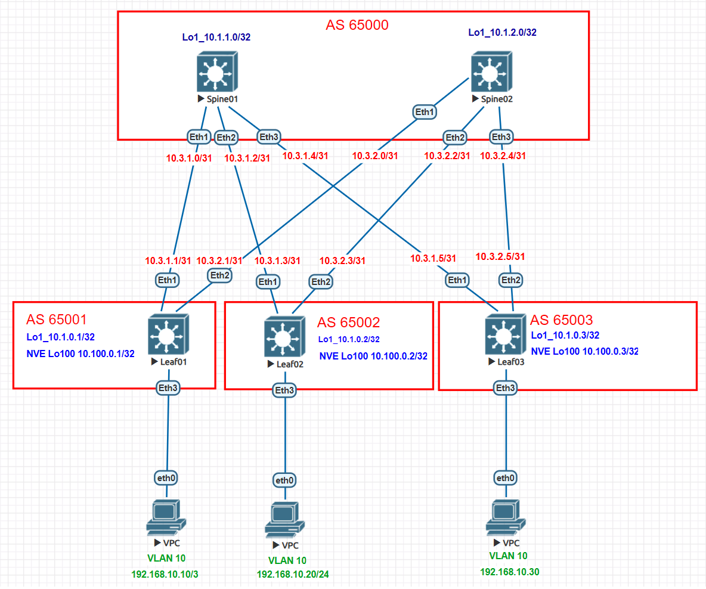

# Домашнее задание №5

## Overlay. VxLAN EVPN L2

### Задача:

- Настроить BGP peering между Leaf и Spine в AF l2vpn evpn
- Проверить связанность между клиентами

## Выполнение:

### Схема сети



### Конфигурация оборудования

- #### [Leaf01](cfg/Leaf01.conf)

```
vlan 10

interface Ethernet3
   description to-client
   switchport access vlan 10

interface Loopback1
   ip address 10.1.0.1/32

interface Loopback100
   description vlxan loopback
   ip address 10.100.0.1/32

interface Management1

interface Vxlan1
   vxlan source-interface Loopback100
   vxlan udp-port 4789
   vxlan vlan 10 vni 10010
   vxlan learn-restrict any

ip prefix-list PL_LOOP
   seq 10 permit 10.1.0.1/32
   seq 20 permit 10.100.0.1/32

route-map RM_CONN permit 10
   match ip address prefix-list PL_LOOP

router bgp 65001
   router-id 10.1.0.1
   timers bgp 3 9
   maximum-paths 10 ecmp 10
   neighbor EVPN peer group
   neighbor EVPN remote-as 65000
   neighbor EVPN update-source Loopback1
   neighbor EVPN ebgp-multihop 3
   neighbor EVPN send-community extended
   neighbor SPINE peer group
   neighbor SPINE remote-as 65000
   neighbor SPINE bfd
   neighbor SPINE allowas-in 1
   neighbor SPINE rib-in pre-policy retain all
   neighbor SPINE send-community extended
   neighbor 10.1.1.0 peer group EVPN
   neighbor 10.1.2.0 peer group EVPN
   neighbor 10.3.1.0 peer group SPINE
   neighbor 10.3.2.0 peer group SPINE
   redistribute connected route-map RM_CONN
   
   vlan 10
      rd 65001:10010
      route-target both 10:10010
      redistribute learned
   
   address-family evpn
      neighbor EVPN activate
   
   address-family ipv4
      neighbor SPINE activate
```

- #### [Leaf02](cfg/Leaf02.conf)

```
vlan 10

interface Ethernet3
   switchport access vlan 10

interface Loopback1
   ip address 10.1.0.2/32

interface Loopback100
   description vxlan loopback
   ip address 10.100.0.2/32

interface Vxlan1
   vxlan source-interface Loopback100
   vxlan udp-port 4789
   vxlan vlan 10 vni 10010
   vxlan learn-restrict any

ip prefix-list PL_LOOP
   seq 10 permit 10.1.0.2/32
   seq 20 permit 10.100.0.2/32

route-map RM_CONN permit 10
   match ip address prefix-list PL_LOOP

router bgp 65002
   router-id 10.1.0.2
   timers bgp 3 9
   maximum-paths 10 ecmp 10
   neighbor EVPN peer group
   neighbor EVPN remote-as 65000
   neighbor EVPN update-source Loopback1
   neighbor EVPN ebgp-multihop 3
   neighbor EVPN send-community extended
   neighbor SPINE peer group
   neighbor SPINE remote-as 65000
   neighbor SPINE bfd
   neighbor SPINE allowas-in 1
   neighbor 10.1.1.0 peer group EVPN
   neighbor 10.1.2.0 peer group EVPN
   neighbor 10.3.1.2 peer group SPINE
   neighbor 10.3.2.2 peer group SPINE
   redistribute connected route-map RM_CONN
   
   vlan 10
      rd 65002:10010
      route-target both 10:10010
      redistribute learned
   
   address-family evpn
      neighbor EVPN activate
   
   address-family ipv4
      neighbor SPINE activate
```

- #### [Leaf03](cfg/Leaf03.conf)

```
vlan 10

interface Ethernet3
   switchport access vlan 10

interface Loopback100
   description vxlan loopback
   ip address 10.100.0.3/32

interface Vxlan1
   vxlan source-interface Loopback100
   vxlan udp-port 4789
   vxlan vlan 10 vni 10010
   vxlan learn-restrict any

ip prefix-list PL_LOOP
   seq 10 permit 10.1.0.3/32
   seq 20 permit 10.100.0.3/32

route-map RM_CONN permit 10
   match ip address prefix-list PL_LOOP

router bgp 65003
   router-id 10.1.0.3
   timers bgp 3 9
   maximum-paths 10 ecmp 10
   neighbor EVPN peer group
   neighbor EVPN remote-as 65000
   neighbor EVPN update-source Loopback1
   neighbor EVPN ebgp-multihop 3
   neighbor EVPN send-community extended
   neighbor SPINE peer group
   neighbor SPINE remote-as 65000
   neighbor SPINE bfd
   neighbor SPINE allowas-in 1
   neighbor 10.1.1.0 peer group EVPN
   neighbor 10.1.2.0 peer group EVPN
   neighbor 10.3.1.4 peer group SPINE
   neighbor 10.3.2.4 peer group SPINE
   redistribute connected route-map RM_CONN
   
   vlan 10
      rd 65003:10010
      route-target both 10:10010
      redistribute learned
   
   address-family evpn
      neighbor EVPN activate
   
   address-family ipv4
      neighbor SPINE activate
```

- #### [Spine01](cfg/Spine01.conf)

```
peer-filter EVPN
   10 match as-range 65001-65003 result accept

peer-filter LEAF
   10 match as-range 65001-65003 result accept

router bgp 65000
      router-id 10.1.1.0
      timers bgp 3 9
      maximum-paths 10 ecmp 10
      bgp listen range 10.1.0.0/24 peer-group EVPN peer-filter EVPN
      bgp listen range 10.3.1.0/24 peer-group LEAF peer-filter LEAF
      neighbor EVPN peer group
      neighbor EVPN next-hop-unchanged
      neighbor EVPN update-source Loopback1
      neighbor EVPN ebgp-multihop 3
      neighbor EVPN send-community extended
      neighbor LEAF peer group
      neighbor LEAF bfd
      neighbor LEAF rib-in pre-policy retain all
      neighbor LEAF send-community
      neighbor LEAF maximum-routes 1000

   address-family evpn
      neighbor EVPN activate

   address-family ipv4
      neighbor LEAF activate
      network 10.1.1.0/32
```

- #### [Spine02](cfg/Spine02.conf)

```
peer-filter EVPN
   10 match as-range 65001-65003 result accept

peer-filter LEAF
   10 match as-range 65001-65003 result accept

router bgp 65000
   router-id 10.1.2.0
   timers bgp 3 9
   maximum-paths 10 ecmp 10
   bgp listen range 10.1.0.0/24 peer-group EVPN peer-filter EVPN
   bgp listen range 10.3.2.0/24 peer-group LEAF peer-filter LEAF
   neighbor EVPN peer group
   neighbor EVPN next-hop-unchanged
   neighbor EVPN update-source Loopback1
   neighbor EVPN ebgp-multihop 3
   neighbor EVPN send-community extended
   neighbor LEAF peer group
   neighbor LEAF bfd
   
   address-family evpn
      neighbor EVPN activate
   
   address-family ipv4
      neighbor LEAF activate
      network 10.1.2.0/32
```

---

### Проверка связанности клиентов по L2

- #### Spine01

```
Spine01#sh bgp evpn summary
BGP summary information for VRF default
Router identifier 10.1.1.0, local AS number 65000
Neighbor Status Codes: m - Under maintenance
  Neighbor V AS           MsgRcvd   MsgSent  InQ OutQ  Up/Down State   PfxRcd PfxAcc
  10.1.0.1 4 65001           1014      1006    0    0 00:42:35 Estab   1      1
  10.1.0.2 4 65002           1011      1020    0    0 00:42:40 Estab   1      1
  10.1.0.3 4 65003           1015      1009    0    0 00:42:36 Estab   1      1
```

- #### Spine02

```
Spine02#sh bgp evpn summary
BGP summary information for VRF default
Router identifier 10.1.2.0, local AS number 65000
Neighbor Status Codes: m - Under maintenance
  Neighbor V AS           MsgRcvd   MsgSent  InQ OutQ  Up/Down State   PfxRcd PfxAcc
  10.1.0.1 4 65001           1055      1326    0    0 00:56:09 Estab   1      1
  10.1.0.2 4 65002           1067      1334    0    0 00:56:17 Estab   1      1
  10.1.0.3 4 65003           1059      1334    0    0 00:56:15 Estab   1      1

```

- #### Leaf01

```
Leaf01#sh ip route

VRF: default
Codes: C - connected, S - static, K - kernel,
       O - OSPF, IA - OSPF inter area, E1 - OSPF external type 1,
       E2 - OSPF external type 2, N1 - OSPF NSSA external type 1,
       N2 - OSPF NSSA external type2, B - Other BGP Routes,
       B I - iBGP, B E - eBGP, R - RIP, I L1 - IS-IS level 1,
       I L2 - IS-IS level 2, O3 - OSPFv3, A B - BGP Aggregate,
       A O - OSPF Summary, NG - Nexthop Group Static Route,
       V - VXLAN Control Service, M - Martian,
       DH - DHCP client installed default route,
       DP - Dynamic Policy Route, L - VRF Leaked,
       G  - gRIBI, RC - Route Cache Route

Gateway of last resort is not set

 C        10.1.0.1/32 is directly connected, Loopback1
 B E      10.1.0.2/32 [200/0] via 10.3.1.0, Ethernet1
                              via 10.3.2.0, Ethernet2
 B E      10.1.0.3/32 [200/0] via 10.3.1.0, Ethernet1
                              via 10.3.2.0, Ethernet2
 B E      10.1.1.0/32 [200/0] via 10.3.1.0, Ethernet1
 B E      10.1.2.0/32 [200/0] via 10.3.2.0, Ethernet2
 C        10.3.1.0/31 is directly connected, Ethernet1
 C        10.3.2.0/31 is directly connected, Ethernet2
 C        10.100.0.1/32 is directly connected, Loopback100
 B E      10.100.0.2/32 [200/0] via 10.3.1.0, Ethernet1
                                via 10.3.2.0, Ethernet2
 B E      10.100.0.3/32 [200/0] via 10.3.1.0, Ethernet1
                                via 10.3.2.0, Ethernet2
```

```
Leaf01#sh ip bgp summary
BGP summary information for VRF default
Router identifier 10.1.0.1, local AS number 65001
Neighbor Status Codes: m - Under maintenance
  Neighbor V AS           MsgRcvd   MsgSent  InQ OutQ  Up/Down State   PfxRcd PfxAcc
  10.1.1.0 4 65000           1670      1682    0    0 01:10:37 Estab   5      5
  10.1.2.0 4 65000           2110      1679    0    0 01:10:34 Estab   5      5
  10.3.1.0 4 65000           1659      1657    0    0 01:10:38 Estab   5      5
  10.3.2.0 4 65000           2102      1666    0    0 01:10:38 Estab   5      5

```

```
Leaf01#show vxlan address-table
          Vxlan Mac Address Table
----------------------------------------------------------------------

VLAN  Mac Address     Type      Prt  VTEP             Moves   Last Move
----  -----------     ----      ---  ----             -----   ---------
  10  0050.7966.6807  EVPN      Vx1  10.100.0.2       1       0:01:06 ago
  10  0050.7966.6808  EVPN      Vx1  10.100.0.3       1       0:00:59 ago
Total Remote Mac Addresses for this criterion: 2
Leaf01#show vxlan vtep
Remote VTEPS for Vxlan1:

VTEP             Tunnel Type(s)
---------------- --------------
10.100.0.2       flood, unicast
10.100.0.3       flood, unicast

Total number of remote VTEPS:  2

```

```
Leaf01#show bgp evpn route-type mac-ip
BGP routing table information for VRF default
Router identifier 10.1.0.1, local AS number 65001
Route status codes: * - valid, > - active, S - Stale, E - ECMP head, e - ECMP
                    c - Contributing to ECMP, % - Pending BGP convergence
Origin codes: i - IGP, e - EGP, ? - incomplete
AS Path Attributes: Or-ID - Originator ID, C-LST - Cluster List, LL Nexthop - Link Local Nexthop

          Network                Next Hop              Metric  LocPref Weight  Path
 * >      RD: 65001:10010 mac-ip 0050.7966.6806
                                 -                     -       -       0       i
 * >Ec    RD: 65002:10010 mac-ip 0050.7966.6807
                                 10.100.0.2            -       100     0       65000 65002 i
 *  ec    RD: 65002:10010 mac-ip 0050.7966.6807
                                 10.100.0.2            -       100     0       65000 65002 i
 * >Ec    RD: 65003:10010 mac-ip 0050.7966.6808
                                 10.100.0.3            -       100     0       65000 65003 i
 *  ec    RD: 65003:10010 mac-ip 0050.7966.6808
                                 10.100.0.3            -       100     0       65000 65003 i

```
```
Leaf01#sh interfaces vxlan 1
Vxlan1 is up, line protocol is up (connected)
  Hardware is Vxlan
  Source interface is Loopback100 and is active with 10.100.0.1
  Listening on UDP port 4789
  Replication/Flood Mode is headend with Flood List Source: EVPN
  Remote MAC learning via EVPN
  VNI mapping to VLANs
  Static VLAN to VNI mapping is
    [10, 10010]
  Note: All Dynamic VLANs used by VCS are internal VLANs.
        Use 'show vxlan vni' for details.
  Static VRF to VNI mapping is not configured
  Headend replication flood vtep list is:
    10 10.100.0.2      10.100.0.3
  Shared Router MAC is 0000.0000.0000
```

```
Leaf01#show vxlan vni
VNI to VLAN Mapping for Vxlan1
VNI         VLAN       Source       Interface       802.1Q Tag
----------- ---------- ------------ --------------- ----------
10010       10         static       Ethernet3       untagged
                                    Vxlan1          10

VNI to dynamic VLAN Mapping for Vxlan1
VNI       VLAN       VRF       Source
--------- ---------- --------- ------------
```


- #### Leaf02
```
Leaf02#sh ip route

VRF: default
Codes: C - connected, S - static, K - kernel,
       O - OSPF, IA - OSPF inter area, E1 - OSPF external type 1,
       E2 - OSPF external type 2, N1 - OSPF NSSA external type 1,
       N2 - OSPF NSSA external type2, B - Other BGP Routes,
       B I - iBGP, B E - eBGP, R - RIP, I L1 - IS-IS level 1,
       I L2 - IS-IS level 2, O3 - OSPFv3, A B - BGP Aggregate,
       A O - OSPF Summary, NG - Nexthop Group Static Route,
       V - VXLAN Control Service, M - Martian,
       DH - DHCP client installed default route,
       DP - Dynamic Policy Route, L - VRF Leaked,
       G  - gRIBI, RC - Route Cache Route

Gateway of last resort is not set

 B E      10.1.0.1/32 [200/0] via 10.3.1.2, Ethernet1
                              via 10.3.2.2, Ethernet2
 C        10.1.0.2/32 is directly connected, Loopback1
 B E      10.1.0.3/32 [200/0] via 10.3.1.2, Ethernet1
                              via 10.3.2.2, Ethernet2
 B E      10.1.1.0/32 [200/0] via 10.3.1.2, Ethernet1
 B E      10.1.2.0/32 [200/0] via 10.3.2.2, Ethernet2
 C        10.3.1.2/31 is directly connected, Ethernet1
 C        10.3.2.2/31 is directly connected, Ethernet2
 B E      10.100.0.1/32 [200/0] via 10.3.1.2, Ethernet1
                                via 10.3.2.2, Ethernet2
 C        10.100.0.2/32 is directly connected, Loopback100
 B E      10.100.0.3/32 [200/0] via 10.3.1.2, Ethernet1
                                via 10.3.2.2, Ethernet2
```

```
Leaf02#sh ip bgp summary
BGP summary information for VRF default
Router identifier 10.1.0.2, local AS number 65002
Neighbor Status Codes: m - Under maintenance
  Neighbor V AS           MsgRcvd   MsgSent  InQ OutQ  Up/Down State   PfxRcd PfxAcc
  10.1.1.0 4 65000           1813      1801    0    0 01:15:58 Estab   5      5
  10.1.2.0 4 65000           2273      1807    0    0 01:15:56 Estab   5      5
  10.3.1.2 4 65000           1793      1788    0    0 01:15:58 Estab   5      5
  10.3.2.2 4 65000           2264      1789    0   19 01:15:57 Estab   5      5
```
```
Leaf02#show vxlan address-table
          Vxlan Mac Address Table
----------------------------------------------------------------------

VLAN  Mac Address     Type      Prt  VTEP             Moves   Last Move
----  -----------     ----      ---  ----             -----   ---------
  10  0050.7966.6806  EVPN      Vx1  10.100.0.1       1       0:00:28 ago
  10  0050.7966.6808  EVPN      Vx1  10.100.0.3       1       0:06:15 ago
Total Remote Mac Addresses for this criterion: 2
Leaf02#show vxlan vtep
Remote VTEPS for Vxlan1:

VTEP             Tunnel Type(s)
---------------- --------------
10.100.0.1       flood, unicast
10.100.0.3       flood, unicast

Total number of remote VTEPS:  2
```
```
Leaf02#show bgp evpn route-type mac-ip
BGP routing table information for VRF default
Router identifier 10.1.0.2, local AS number 65002
Route status codes: * - valid, > - active, S - Stale, E - ECMP head, e - ECMP
                    c - Contributing to ECMP, % - Pending BGP convergence
Origin codes: i - IGP, e - EGP, ? - incomplete
AS Path Attributes: Or-ID - Originator ID, C-LST - Cluster List, LL Nexthop - Link Local Nexthop

          Network                Next Hop              Metric  LocPref Weight  Path
 * >Ec    RD: 65001:10010 mac-ip 0050.7966.6806
                                 10.100.0.1            -       100     0       65000 65001 i
 *  ec    RD: 65001:10010 mac-ip 0050.7966.6806
                                 10.100.0.1            -       100     0       65000 65001 i
 * >      RD: 65002:10010 mac-ip 0050.7966.6807
                                 -                     -       -       0       i
 * >Ec    RD: 65003:10010 mac-ip 0050.7966.6808
                                 10.100.0.3            -       100     0       65000 65003 i
 *  ec    RD: 65003:10010 mac-ip 0050.7966.6808
                                 10.100.0.3            -       100     0       65000 65003 i
                                 ```
```
```
Leaf02#sh interfaces vxlan 1
Vxlan1 is up, line protocol is up (connected)
  Hardware is Vxlan
  Source interface is Loopback100 and is active with 10.100.0.2
  Listening on UDP port 4789
  Replication/Flood Mode is headend with Flood List Source: EVPN
  Remote MAC learning via EVPN
  VNI mapping to VLANs
  Static VLAN to VNI mapping is
    [10, 10010]
  Note: All Dynamic VLANs used by VCS are internal VLANs.
        Use 'show vxlan vni' for details.
  Static VRF to VNI mapping is not configured
  Headend replication flood vtep list is:
    10 10.100.0.1      10.100.0.3
  Shared Router MAC is 0000.0000.0000
```
```
Leaf02#show vxlan vni
VNI to VLAN Mapping for Vxlan1
VNI         VLAN       Source       Interface       802.1Q Tag
----------- ---------- ------------ --------------- ----------
10010       10         static       Ethernet3       untagged
                                    Vxlan1          10

VNI to dynamic VLAN Mapping for Vxlan1
VNI       VLAN       VRF       Source
--------- ---------- --------- ------------
```


- #### Leaf03
```
Leaf03#sh ip route

VRF: default
Codes: C - connected, S - static, K - kernel,
       O - OSPF, IA - OSPF inter area, E1 - OSPF external type 1,
       E2 - OSPF external type 2, N1 - OSPF NSSA external type 1,
       N2 - OSPF NSSA external type2, B - Other BGP Routes,
       B I - iBGP, B E - eBGP, R - RIP, I L1 - IS-IS level 1,
       I L2 - IS-IS level 2, O3 - OSPFv3, A B - BGP Aggregate,
       A O - OSPF Summary, NG - Nexthop Group Static Route,
       V - VXLAN Control Service, M - Martian,
       DH - DHCP client installed default route,
       DP - Dynamic Policy Route, L - VRF Leaked,
       G  - gRIBI, RC - Route Cache Route

Gateway of last resort is not set

 B E      10.1.0.1/32 [200/0] via 10.3.1.4, Ethernet1
                              via 10.3.2.4, Ethernet2
 B E      10.1.0.2/32 [200/0] via 10.3.1.4, Ethernet1
                              via 10.3.2.4, Ethernet2
 C        10.1.0.3/32 is directly connected, Loopback1
 B E      10.1.1.0/32 [200/0] via 10.3.1.4, Ethernet1
 B E      10.1.2.0/32 [200/0] via 10.3.2.4, Ethernet2
 C        10.3.1.4/31 is directly connected, Ethernet1
 C        10.3.2.4/31 is directly connected, Ethernet2
 B E      10.100.0.1/32 [200/0] via 10.3.1.4, Ethernet1
                                via 10.3.2.4, Ethernet2
 B E      10.100.0.2/32 [200/0] via 10.3.1.4, Ethernet1
                                via 10.3.2.4, Ethernet2
 C        10.100.0.3/32 is directly connected, Loopback100
 
```

```
Leaf03#sh ip bgp summary
BGP summary information for VRF default
Router identifier 10.1.0.3, local AS number 65003
Neighbor Status Codes: m - Under maintenance
  Neighbor V AS           MsgRcvd   MsgSent  InQ OutQ  Up/Down State   PfxRcd PfxAcc
  10.1.1.0 4 65000           1822      1826    0    0 01:16:54 Estab   5      5
  10.1.2.0 4 65000           2303      1821    0    0 01:16:54 Estab   5      5
  10.3.1.4 4 65000           1810      1808    0    0 01:16:55 Estab   5      5
  10.3.2.4 4 65000           2283      1816    0    0 01:16:55 Estab   5      5
```

```
Leaf03#show vxlan address-table
          Vxlan Mac Address Table
----------------------------------------------------------------------

VLAN  Mac Address     Type      Prt  VTEP             Moves   Last Move
----  -----------     ----      ---  ----             -----   ---------
  10  0050.7966.6806  EVPN      Vx1  10.100.0.1       1       0:01:27 ago
  10  0050.7966.6807  EVPN      Vx1  10.100.0.2       1       0:07:20 ago
Total Remote Mac Addresses for this criterion: 2
```
```
Leaf03#show vxlan vtep
Remote VTEPS for Vxlan1:

VTEP             Tunnel Type(s)
---------------- --------------
10.100.0.1       unicast, flood
10.100.0.2       unicast, flood

Total number of remote VTEPS:  2
```

```
Leaf03#show bgp evpn route-type mac-ip
BGP routing table information for VRF default
Router identifier 10.1.0.3, local AS number 65003
Route status codes: * - valid, > - active, S - Stale, E - ECMP head, e - ECMP
                    c - Contributing to ECMP, % - Pending BGP convergence
Origin codes: i - IGP, e - EGP, ? - incomplete
AS Path Attributes: Or-ID - Originator ID, C-LST - Cluster List, LL Nexthop - Link Local Nexthop

          Network                Next Hop              Metric  LocPref Weight  Path
 * >Ec    RD: 65001:10010 mac-ip 0050.7966.6806
                                 10.100.0.1            -       100     0       65000 65001 i
 *  ec    RD: 65001:10010 mac-ip 0050.7966.6806
                                 10.100.0.1            -       100     0       65000 65001 i
 * >Ec    RD: 65002:10010 mac-ip 0050.7966.6807
                                 10.100.0.2            -       100     0       65000 65002 i
 *  ec    RD: 65002:10010 mac-ip 0050.7966.6807
                                 10.100.0.2            -       100     0       65000 65002 i
 * >      RD: 65003:10010 mac-ip 0050.7966.6808
                                 -                     -       -       0       i
```
```
Leaf03#sh interfaces vxlan 1
Vxlan1 is up, line protocol is up (connected)
  Hardware is Vxlan
  Source interface is Loopback100 and is active with 10.100.0.3
  Listening on UDP port 4789
  Replication/Flood Mode is headend with Flood List Source: EVPN
  Remote MAC learning via EVPN
  VNI mapping to VLANs
  Static VLAN to VNI mapping is
    [10, 10010]
  Note: All Dynamic VLANs used by VCS are internal VLANs.
        Use 'show vxlan vni' for details.
  Static VRF to VNI mapping is not configured
  Headend replication flood vtep list is:
    10 10.100.0.1      10.100.0.2
  Shared Router MAC is 0000.0000.0000
```
```
Leaf03#show vxlan vni
VNI to VLAN Mapping for Vxlan1
VNI         VLAN       Source       Interface       802.1Q Tag
----------- ---------- ------------ --------------- ----------
10010       10         static       Ethernet3       untagged
                                    Vxlan1          10

VNI to dynamic VLAN Mapping for Vxlan1
VNI       VLAN       VRF       Source
--------- ---------- --------- ------------
```
- #### client-1

```
VPCS> ping 192.168.10.20
84 bytes from 192.168.10.21 icmp_seq=1 ttl=64 time=11.172 ms
84 bytes from 192.168.10.21 icmp_seq=2 ttl=64 time=10.478 ms
84 bytes from 192.168.10.21 icmp_seq=3 ttl=64 time=11.873 ms
84 bytes from 192.168.10.21 icmp_seq=4 ttl=64 time=10.500 ms
84 bytes from 192.168.10.21 icmp_seq=5 ttl=64 time=10.308 ms

VPCS> ping 192.168.10.30
84 bytes from 192.168.10.31 icmp_seq=1 ttl=64 time=17.274 ms
84 bytes from 192.168.10.31 icmp_seq=2 ttl=64 time=11.062 ms
84 bytes from 192.168.10.31 icmp_seq=3 ttl=64 time=11.495 ms
84 bytes from 192.168.10.31 icmp_seq=4 ttl=64 time=11.849 ms
84 bytes from 192.168.10.31 icmp_seq=5 ttl=64 time=9.009 ms
```

