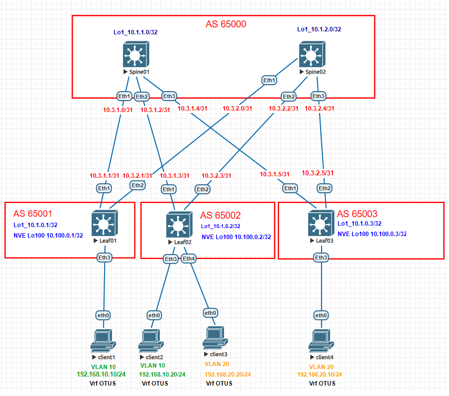

# Домашнее задание №6

## Overlay. VxLAN EVPN L3

### Задача:

- Настроить клиентов в разных VNI
- Настроить маршрутизацию между клиентами 
- Проверить связанность между клиентами

## Выполнение:

### Схема сети 



### Конфигурация оборудования

- #### [Leaf01](cfg/Leaf01.conf)

```
vrf instance OTUS

interface Ethernet3
   description to-client
   switchport access vlan 10

interface Vlan10
   vrf OTUS
   ip address virtual 192.168.10.254/24

interface Vxlan1
   vxlan source-interface Loopback100
   vxlan udp-port 4789
   vxlan vlan 10 vni 10010
   vxlan vrf OTUS vni 999

ip routing vrf OTUS

router bgp 65001

   vrf OTUS
      rd 65001:999
      route-target import evpn 999:999
      route-target export evpn 999:999
!
```

- #### [Leaf02](cfg/Leaf02.conf)

```
vrf instance OTUS

interface Ethernet3
   switchport access vlan 10

interface Ethernet4
   switchport access vlan 20


interface Vlan10
   vrf OTUS
   ip address virtual 192.168.10.254/24

interface Vlan20
   vrf OTUS
   ip address virtual 192.168.20.254/24

interface Vxlan1
   vxlan source-interface Loopback100
   vxlan udp-port 4789
   vxlan vlan 10 vni 10010
   vxlan vlan 20 vni 10020
   vxlan vrf OTUS vni 999

router bgp 65002

   vlan 10
      rd 65002:10010
      route-target both 10:10010
      redistribute learned

   vlan 20
      rd 65002:10020
      route-target both 20:10020
      redistribute learned


   vrf OTUS
      rd 65002:999
      route-target import evpn 999:999
      route-target export evpn 999:999
```

- #### [Leaf03](cfg/Leaf03.conf)

```
vrf instance OTUS

interface Ethernet3
   switchport access vlan 20


interface Vlan20
   vrf OTUS
   ip address virtual 192.168.20.254/24

interface Vxlan1
   vxlan source-interface Loopback100
   vxlan udp-port 4789
   vxlan vlan 20 vni 10020
   vxlan vrf OTUS vni 999


ip routing vrf OTUS

router bgp 65003

   vlan 20
      rd 65003:10020
      route-target both 20:10020
      redistribute learned


   vrf OTUS
      rd 65003:999
      route-target import evpn 999:999
      route-target export evpn 999:999


```
- #### [Spine01](cfg/Spine01.conf)

- #### [Spine02](cfg/Spine02.conf)
---

### Проверка связанности клиентов по L3

- #### Leaf01
```
Leaf01#sh ip route vrf OTUS

VRF: OTUS
Codes: C - connected, S - static, K - kernel,
       O - OSPF, IA - OSPF inter area, E1 - OSPF external type 1,
       E2 - OSPF external type 2, N1 - OSPF NSSA external type 1,
       N2 - OSPF NSSA external type2, B - Other BGP Routes,
       B I - iBGP, B E - eBGP, R - RIP, I L1 - IS-IS level 1,
       I L2 - IS-IS level 2, O3 - OSPFv3, A B - BGP Aggregate,
       A O - OSPF Summary, NG - Nexthop Group Static Route,
       V - VXLAN Control Service, M - Martian,
       DH - DHCP client installed default route,
       DP - Dynamic Policy Route, L - VRF Leaked,
       G  - gRIBI, RC - Route Cache Route

Gateway of last resort is not set

 B E      192.168.10.20/32 [200/0] via VTEP 10.100.0.2 VNI 999 router-mac 50:00:00:03:37:66 local-interface Vxlan1
 C        192.168.10.0/24 is directly connected, Vlan10
 B E      192.168.20.10/32 [200/0] via VTEP 10.100.0.3 VNI 999 router-mac 50:00:00:15:f4:e8 local-interface Vxlan1
 B E      192.168.20.20/32 [200/0] via VTEP 10.100.0.2 VNI 999 router-mac 50:00:00:03:37:66 local-interface Vxlan1
```
```
Leaf01#sh bgp evpn route-type mac-ip
BGP routing table information for VRF default
Router identifier 10.1.0.1, local AS number 65001
Route status codes: * - valid, > - active, S - Stale, E - ECMP head, e - ECMP
                    c - Contributing to ECMP, % - Pending BGP convergence
Origin codes: i - IGP, e - EGP, ? - incomplete
AS Path Attributes: Or-ID - Originator ID, C-LST - Cluster List, LL Nexthop - Link Local Nexthop

          Network                Next Hop              Metric  LocPref Weight  Path
 * >      RD: 65001:10010 mac-ip 0050.7966.6806
                                 -                     -       -       0       i
 * >      RD: 65001:10010 mac-ip 0050.7966.6806 192.168.10.10
                                 -                     -       -       0       i
 * >Ec    RD: 65002:10010 mac-ip 0050.7966.6807
                                 10.100.0.2            -       100     0       65000 65002 i
 *  ec    RD: 65002:10010 mac-ip 0050.7966.6807
                                 10.100.0.2            -       100     0       65000 65002 i
 * >Ec    RD: 65002:10010 mac-ip 0050.7966.6807 192.168.10.20
                                 10.100.0.2            -       100     0       65000 65002 i
 *  ec    RD: 65002:10010 mac-ip 0050.7966.6807 192.168.10.20
                                 10.100.0.2            -       100     0       65000 65002 i
 * >Ec    RD: 65003:10020 mac-ip 0050.7966.6808
                                 10.100.0.3            -       100     0       65000 65003 i
 *  ec    RD: 65003:10020 mac-ip 0050.7966.6808
                                 10.100.0.3            -       100     0       65000 65003 i
 * >Ec    RD: 65003:10020 mac-ip 0050.7966.6808 192.168.20.10
                                 10.100.0.3            -       100     0       65000 65003 i
 *  ec    RD: 65003:10020 mac-ip 0050.7966.6808 192.168.20.10
                                 10.100.0.3            -       100     0       65000 65003 i
 * >Ec    RD: 65002:10020 mac-ip 0050.7966.6809
                                 10.100.0.2            -       100     0       65000 65002 i
 *  ec    RD: 65002:10020 mac-ip 0050.7966.6809
                                 10.100.0.2            -       100     0       65000 65002 i
 * >Ec    RD: 65002:10020 mac-ip 0050.7966.6809 192.168.20.20
                                 10.100.0.2            -       100     0       65000 65002 i
 *  ec    RD: 65002:10020 mac-ip 0050.7966.6809 192.168.20.20
                                 10.100.0.2            -       100     0       65000 65002 i
```
```
Leaf01#show bgp evpn route-type ip-prefix ipv4
BGP routing table information for VRF default
Router identifier 10.1.0.1, local AS number 65001
Route status codes: * - valid, > - active, S - Stale, E - ECMP head, e - ECMP
                    c - Contributing to ECMP, % - Pending BGP convergence
Origin codes: i - IGP, e - EGP, ? - incomplete
AS Path Attributes: Or-ID - Originator ID, C-LST - Cluster List, LL Nexthop - Link Local Nexthop

          Network                Next Hop              Metric  LocPref Weight  Path
```
```
Leaf01#sh arp vrf OTUS
Address         Age (sec)  Hardware Addr   Interface
192.168.10.10     0:01:46  0050.7966.6806  Vlan10, Ethernet3
192.168.10.20           -  0050.7966.6807  Vlan10, Vxlan1
Leaf01#sh interfaces vxlan 1
Vxlan1 is up, line protocol is up (connected)
  Hardware is Vxlan
  Source interface is Loopback100 and is active with 10.100.0.1
  Listening on UDP port 4789
  Replication/Flood Mode is headend with Flood List Source: EVPN
  Remote MAC learning via EVPN
  VNI mapping to VLANs
  Static VLAN to VNI mapping is
    [10, 10010]
  Dynamic VLAN to VNI mapping for 'evpn' is
    [4094, 999]
  Note: All Dynamic VLANs used by VCS are internal VLANs.
        Use 'show vxlan vni' for details.
  Static VRF to VNI mapping is
   [OTUS, 999]
  Headend replication flood vtep list is:
    10 10.100.0.2
  Shared Router MAC is 0000.0000.0000
```
```
Leaf01#show vxlan vni
VNI to VLAN Mapping for Vxlan1
VNI         VLAN       Source       Interface       802.1Q Tag
----------- ---------- ------------ --------------- ----------
10010       10         static       Ethernet3       untagged
                                    Vxlan1          10

VNI to dynamic VLAN Mapping for Vxlan1
VNI       VLAN       VRF        Source
--------- ---------- ---------- ------------
999       4094       OTUS       evpn

```

- #### Leaf02
```
Leaf02#sh ip route vrf OTUS

VRF: OTUS
Codes: C - connected, S - static, K - kernel,
       O - OSPF, IA - OSPF inter area, E1 - OSPF external type 1,
       E2 - OSPF external type 2, N1 - OSPF NSSA external type 1,
       N2 - OSPF NSSA external type2, B - Other BGP Routes,
       B I - iBGP, B E - eBGP, R - RIP, I L1 - IS-IS level 1,
       I L2 - IS-IS level 2, O3 - OSPFv3, A B - BGP Aggregate,
       A O - OSPF Summary, NG - Nexthop Group Static Route,
       V - VXLAN Control Service, M - Martian,
       DH - DHCP client installed default route,
       DP - Dynamic Policy Route, L - VRF Leaked,
       G  - gRIBI, RC - Route Cache Route

Gateway of last resort is not set

 B E      192.168.10.10/32 [200/0] via VTEP 10.100.0.1 VNI 999 router-mac 50:00:00:d5:5d:c0 local-interface Vxlan1
 C        192.168.10.0/24 is directly connected, Vlan10
 B E      192.168.20.10/32 [200/0] via VTEP 10.100.0.3 VNI 999 router-mac 50:00:00:15:f4:e8 local-interface Vxlan1
 C        192.168.20.0/24 is directly connected, Vlan20
```
```
Leaf02#sh bgp evpn route-type mac-ip
BGP routing table information for VRF default
Router identifier 10.1.0.2, local AS number 65002
Route status codes: * - valid, > - active, S - Stale, E - ECMP head, e - ECMP
                    c - Contributing to ECMP, % - Pending BGP convergence
Origin codes: i - IGP, e - EGP, ? - incomplete
AS Path Attributes: Or-ID - Originator ID, C-LST - Cluster List, LL Nexthop - Link Local Nexthop

          Network                Next Hop              Metric  LocPref Weight  Path
 * >Ec    RD: 65001:10010 mac-ip 0050.7966.6806
                                 10.100.0.1            -       100     0       65000 65001 i
 *  ec    RD: 65001:10010 mac-ip 0050.7966.6806
                                 10.100.0.1            -       100     0       65000 65001 i
 * >Ec    RD: 65001:10010 mac-ip 0050.7966.6806 192.168.10.10
                                 10.100.0.1            -       100     0       65000 65001 i
 *  ec    RD: 65001:10010 mac-ip 0050.7966.6806 192.168.10.10
                                 10.100.0.1            -       100     0       65000 65001 i
 * >      RD: 65002:10010 mac-ip 0050.7966.6807
                                 -                     -       -       0       i
 * >      RD: 65002:10010 mac-ip 0050.7966.6807 192.168.10.20
                                 -                     -       -       0       i
 * >Ec    RD: 65003:10020 mac-ip 0050.7966.6808
                                 10.100.0.3            -       100     0       65000 65003 i
 *  ec    RD: 65003:10020 mac-ip 0050.7966.6808
                                 10.100.0.3            -       100     0       65000 65003 i
 * >Ec    RD: 65003:10020 mac-ip 0050.7966.6808 192.168.20.10
                                 10.100.0.3            -       100     0       65000 65003 i
 *  ec    RD: 65003:10020 mac-ip 0050.7966.6808 192.168.20.10
                                 10.100.0.3            -       100     0       65000 65003 i
 * >      RD: 65002:10020 mac-ip 0050.7966.6809
                                 -                     -       -       0       i
 * >      RD: 65002:10020 mac-ip 0050.7966.6809 192.168.20.20
                                 -                     -       -       0       i
```
```
Leaf02#show bgp evpn route-type ip-prefix ipv4
BGP routing table information for VRF default
Router identifier 10.1.0.2, local AS number 65002
Route status codes: * - valid, > - active, S - Stale, E - ECMP head, e - ECMP
                    c - Contributing to ECMP, % - Pending BGP convergence
Origin codes: i - IGP, e - EGP, ? - incomplete
AS Path Attributes: Or-ID - Originator ID, C-LST - Cluster List, LL Nexthop - Link Local Nexthop

          Network                Next Hop              Metric  LocPref Weight  Path
```
```
Leaf02#sh arp vrf OTUS
Address         Age (sec)  Hardware Addr   Interface
192.168.10.10           -  0050.7966.6806  Vlan10, Vxlan1
192.168.10.20     0:02:50  0050.7966.6807  Vlan10, Ethernet3
192.168.20.10           -  0050.7966.6808  Vlan20, Vxlan1
192.168.20.20     0:01:13  0050.7966.6809  Vlan20, Ethernet4
Leaf02#sh interfaces vxlan 1
Vxlan1 is up, line protocol is up (connected)
  Hardware is Vxlan
  Source interface is Loopback100 and is active with 10.100.0.2
  Listening on UDP port 4789
  Replication/Flood Mode is headend with Flood List Source: EVPN
  Remote MAC learning via EVPN
  VNI mapping to VLANs
  Static VLAN to VNI mapping is
    [10, 10010]       [20, 10020]
  Dynamic VLAN to VNI mapping for 'evpn' is
    [4094, 999]
  Note: All Dynamic VLANs used by VCS are internal VLANs.
        Use 'show vxlan vni' for details.
  Static VRF to VNI mapping is
   [OTUS, 999]
  Headend replication flood vtep list is:
    10 10.100.0.1
    20 10.100.0.3
  Shared Router MAC is 0000.0000.0000
```
```
Leaf02#show vxlan vni
VNI to VLAN Mapping for Vxlan1
VNI         VLAN       Source       Interface       802.1Q Tag
----------- ---------- ------------ --------------- ----------
10010       10         static       Ethernet3       untagged
                                    Vxlan1          10
10020       20         static       Ethernet4       untagged
                                    Vxlan1          20

VNI to dynamic VLAN Mapping for Vxlan1
VNI       VLAN       VRF        Source
--------- ---------- ---------- ------------
999       4094       OTUS       evpn


```

- #### Leaf03
```
Leaf03#sh ip route vrf OTUS

VRF: OTUS
Codes: C - connected, S - static, K - kernel,
       O - OSPF, IA - OSPF inter area, E1 - OSPF external type 1,
       E2 - OSPF external type 2, N1 - OSPF NSSA external type 1,
       N2 - OSPF NSSA external type2, B - Other BGP Routes,
       B I - iBGP, B E - eBGP, R - RIP, I L1 - IS-IS level 1,
       I L2 - IS-IS level 2, O3 - OSPFv3, A B - BGP Aggregate,
       A O - OSPF Summary, NG - Nexthop Group Static Route,
       V - VXLAN Control Service, M - Martian,
       DH - DHCP client installed default route,
       DP - Dynamic Policy Route, L - VRF Leaked,
       G  - gRIBI, RC - Route Cache Route

Gateway of last resort is not set

 B E      192.168.10.10/32 [200/0] via VTEP 10.100.0.1 VNI 999 router-mac 50:00:00:d5:5d:c0 local-interface Vxlan1
 B E      192.168.10.20/32 [200/0] via VTEP 10.100.0.2 VNI 999 router-mac 50:00:00:03:37:66 local-interface Vxlan1
 B E      192.168.20.20/32 [200/0] via VTEP 10.100.0.2 VNI 999 router-mac 50:00:00:03:37:66 local-interface Vxlan1
 C        192.168.20.0/24 is directly connected, Vlan20
```
```
Leaf03#sh bgp evpn route-type mac-ip
BGP routing table information for VRF default
Router identifier 10.1.0.3, local AS number 65003
Route status codes: * - valid, > - active, S - Stale, E - ECMP head, e - ECMP
                    c - Contributing to ECMP, % - Pending BGP convergence
Origin codes: i - IGP, e - EGP, ? - incomplete
AS Path Attributes: Or-ID - Originator ID, C-LST - Cluster List, LL Nexthop - Link Local Nexthop

          Network                Next Hop              Metric  LocPref Weight  Path
 * >Ec    RD: 65001:10010 mac-ip 0050.7966.6806
                                 10.100.0.1            -       100     0       65000 65001 i
 *  ec    RD: 65001:10010 mac-ip 0050.7966.6806
                                 10.100.0.1            -       100     0       65000 65001 i
 * >Ec    RD: 65001:10010 mac-ip 0050.7966.6806 192.168.10.10
                                 10.100.0.1            -       100     0       65000 65001 i
 *  ec    RD: 65001:10010 mac-ip 0050.7966.6806 192.168.10.10
                                 10.100.0.1            -       100     0       65000 65001 i
 * >Ec    RD: 65002:10010 mac-ip 0050.7966.6807
                                 10.100.0.2            -       100     0       65000 65002 i
 *  ec    RD: 65002:10010 mac-ip 0050.7966.6807
                                 10.100.0.2            -       100     0       65000 65002 i
 * >Ec    RD: 65002:10010 mac-ip 0050.7966.6807 192.168.10.20
                                 10.100.0.2            -       100     0       65000 65002 i
 *  ec    RD: 65002:10010 mac-ip 0050.7966.6807 192.168.10.20
                                 10.100.0.2            -       100     0       65000 65002 i
 * >      RD: 65003:10020 mac-ip 0050.7966.6808
                                 -                     -       -       0       i
 * >      RD: 65003:10020 mac-ip 0050.7966.6808 192.168.20.10
                                 -                     -       -       0       i
 * >Ec    RD: 65002:10020 mac-ip 0050.7966.6809
                                 10.100.0.2            -       100     0       65000 65002 i
 *  ec    RD: 65002:10020 mac-ip 0050.7966.6809
                                 10.100.0.2            -       100     0       65000 65002 i
 * >Ec    RD: 65002:10020 mac-ip 0050.7966.6809 192.168.20.20
                                 10.100.0.2            -       100     0       65000 65002 i
 *  ec    RD: 65002:10020 mac-ip 0050.7966.6809 192.168.20.20
                                 10.100.0.2            -       100     0       65000 65002 i
```
```
Leaf03#show bgp evpn route-type ip-prefix ipv4
BGP routing table information for VRF default
Router identifier 10.1.0.3, local AS number 65003
Route status codes: * - valid, > - active, S - Stale, E - ECMP head, e - ECMP
                    c - Contributing to ECMP, % - Pending BGP convergence
Origin codes: i - IGP, e - EGP, ? - incomplete
AS Path Attributes: Or-ID - Originator ID, C-LST - Cluster List, LL Nexthop - Link Local Nexthop

          Network                Next Hop              Metric  LocPref Weight  Path
```
```
Leaf03#sh arp vrf OTUS
Address         Age (sec)  Hardware Addr   Interface
192.168.20.10     0:03:33  0050.7966.6808  Vlan20, Ethernet3
192.168.20.20           -  0050.7966.6809  Vlan20, Vxlan1
Leaf03#sh interfaces vxlan 1
Vxlan1 is up, line protocol is up (connected)
  Hardware is Vxlan
  Source interface is Loopback100 and is active with 10.100.0.3
  Listening on UDP port 4789
  Replication/Flood Mode is headend with Flood List Source: EVPN
  Remote MAC learning via EVPN
  VNI mapping to VLANs
  Static VLAN to VNI mapping is
    [20, 10020]
  Dynamic VLAN to VNI mapping for 'evpn' is
    [4094, 999]
  Note: All Dynamic VLANs used by VCS are internal VLANs.
        Use 'show vxlan vni' for details.
  Static VRF to VNI mapping is
   [OTUS, 999]
  Headend replication flood vtep list is:
    20 10.100.0.2
  Shared Router MAC is 0000.0000.0000
```
```
Leaf03#show vxlan vni
VNI to VLAN Mapping for Vxlan1
VNI         VLAN       Source       Interface       802.1Q Tag
----------- ---------- ------------ --------------- ----------
10020       20         static       Ethernet3       untagged
                                    Vxlan1          20

VNI to dynamic VLAN Mapping for Vxlan1
VNI       VLAN       VRF        Source
--------- ---------- ---------- ------------
999       4094       OTUS       evpn


```

- #### client-1

```
VPCS> ping 192.168.10.20

84 bytes from 192.168.10.20 icmp_seq=1 ttl=64 time=21.135 ms
84 bytes from 192.168.10.20 icmp_seq=2 ttl=64 time=12.033 ms
84 bytes from 192.168.10.20 icmp_seq=3 ttl=64 time=11.022 ms
84 bytes from 192.168.10.20 icmp_seq=4 ttl=64 time=14.594 ms
84 bytes from 192.168.10.20 icmp_seq=5 ttl=64 time=12.105 ms

VPCS> ping 192.168.20.20

84 bytes from 192.168.20.20 icmp_seq=1 ttl=62 time=29.739 ms
84 bytes from 192.168.20.20 icmp_seq=2 ttl=62 time=14.033 ms
84 bytes from 192.168.20.20 icmp_seq=3 ttl=62 time=12.605 ms
84 bytes from 192.168.20.20 icmp_seq=4 ttl=62 time=13.105 ms
84 bytes from 192.168.20.20 icmp_seq=5 ttl=62 time=12.092 ms

VPCS> ping 192.168.20.10

84 bytes from 192.168.20.10 icmp_seq=1 ttl=62 time=21.177 ms
84 bytes from 192.168.20.10 icmp_seq=2 ttl=62 time=11.843 ms
84 bytes from 192.168.20.10 icmp_seq=3 ttl=62 time=12.739 ms
84 bytes from 192.168.20.10 icmp_seq=4 ttl=62 time=12.278 ms
84 bytes from 192.168.20.10 icmp_seq=5 ttl=62 time=14.231 ms

```

- #### client-4

```
VPCS> ping 192.168.10.10

84 bytes from 192.168.10.10 icmp_seq=1 ttl=62 time=11.962 ms
84 bytes from 192.168.10.10 icmp_seq=2 ttl=62 time=12.988 ms
84 bytes from 192.168.10.10 icmp_seq=3 ttl=62 time=11.818 ms
84 bytes from 192.168.10.10 icmp_seq=4 ttl=62 time=13.373 ms
84 bytes from 192.168.10.10 icmp_seq=5 ttl=62 time=13.046 ms

VPCS> ping 192.168.10.20

84 bytes from 192.168.10.20 icmp_seq=1 ttl=62 time=11.681 ms
84 bytes from 192.168.10.20 icmp_seq=2 ttl=62 time=13.507 ms
84 bytes from 192.168.10.20 icmp_seq=3 ttl=62 time=11.938 ms
84 bytes from 192.168.10.20 icmp_seq=4 ttl=62 time=12.558 ms
84 bytes from 192.168.10.20 icmp_seq=5 ttl=62 time=11.666 ms

VPCS> ping 192.168.20.20

84 bytes from 192.168.20.20 icmp_seq=1 ttl=64 time=11.644 ms
84 bytes from 192.168.20.20 icmp_seq=2 ttl=64 time=10.876 ms
84 bytes from 192.168.20.20 icmp_seq=3 ttl=64 time=11.179 ms
84 bytes from 192.168.20.20 icmp_seq=4 ttl=64 time=10.785 ms
84 bytes from 192.168.20.20 icmp_seq=5 ttl=64 time=11.193 ms

```

