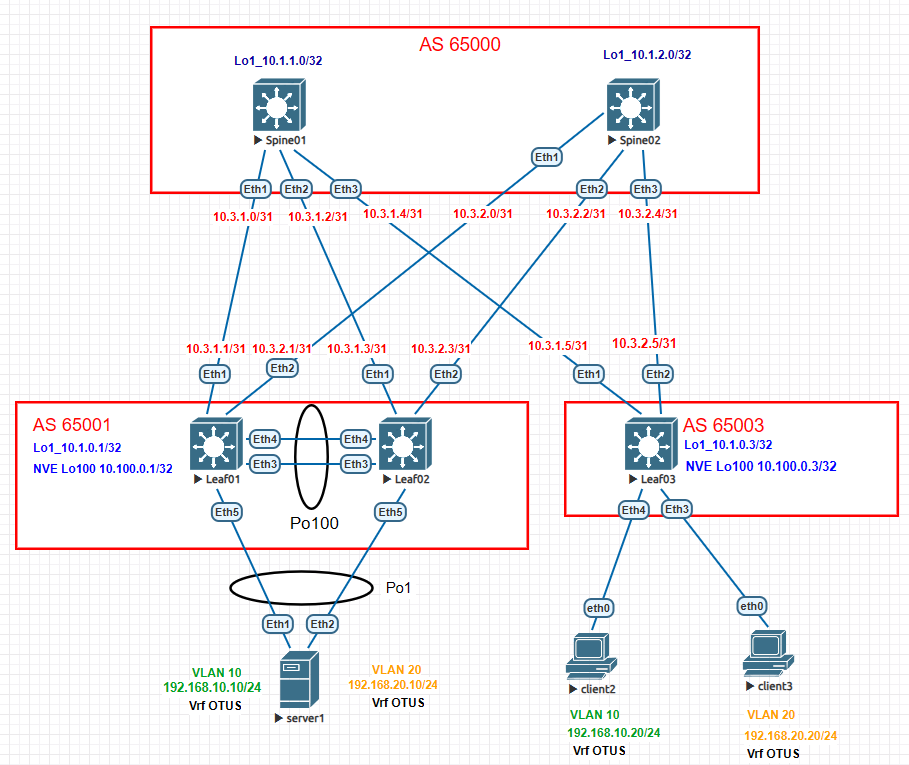

# Домашнее задание №7

## Overlay. VxLAN VPC

### Задача:

- Подключить клиентов 2-я линками к разным Leaf
- Настроить агрегированный канал со стороны клиента 
- Настроить VPC для работы в Overlay сети
- Проверить связанность между клиентами

## Выполнение:

### Схема сети 



### Конфигурация оборудования

- #### [Leaf01](cfg/Leaf01.conf)

```
no spanning-tree vlan-id 4094

vlan 10,20

vlan 4094
   trunk group peer-link

interface Port-Channel1
   switchport trunk allowed vlan 10,20
   switchport mode trunk
   mlag 1

interface Port-Channel100
   switchport mode trunk
   switchport trunk group peer-link

interface Ethernet3
   channel-group 100 mode active

interface Ethernet4
   channel-group 100 mode active

interface Ethernet5
   channel-group 1 mode active


interface Vlan10
   vrf OTUS
   ip address virtual 192.168.10.254/24

interface Vlan20
   vrf OTUS
   ip address virtual 192.168.20.254/24

interface Vlan4094
   ip address 10.100.100.0/31

interface Vxlan1
   vxlan source-interface Loopback100
   vxlan udp-port 4789
   vxlan vlan 10 vni 10010
   vxlan vlan 20 vni 10020
   vxlan vrf OTUS vni 999
   vxlan virtual-vtep local-interface Loopback100

ip virtual-router mac-address 00:00:00:00:00:01

mlag configuration
   domain-id mlag1
   local-interface Vlan4094
   peer-address 10.100.100.1
   peer-link Port-Channel100

router bgp 65001
   router-id 10.1.0.1
   timers bgp 3 9
   maximum-paths 10 ecmp 10
   neighbor EVPN peer group
   neighbor EVPN remote-as 65000
   neighbor EVPN update-source Loopback1
   neighbor EVPN ebgp-multihop 3
   neighbor EVPN send-community extended
   neighbor SPINE peer group
   neighbor SPINE remote-as 65000
   neighbor SPINE bfd
   neighbor SPINE allowas-in 1
   neighbor SPINE rib-in pre-policy retain all
   neighbor SPINE send-community extended
   neighbor 10.1.1.0 peer group EVPN
   neighbor 10.1.2.0 peer group EVPN
   neighbor 10.3.1.0 peer group SPINE
   neighbor 10.3.2.0 peer group SPINE
   redistribute connected route-map RM_CONN

   vlan 10
      rd 65001:10010
      route-target both 10:10010
      redistribute learned

   vlan 20
      rd 65001:10020
      route-target both 20:10020
      redistribute learned

   address-family evpn
      neighbor EVPN activate

   address-family ipv4
      neighbor SPINE activate

   vrf OTUS
      rd 65001:999
      route-target import evpn 999:999
      route-target export evpn 999:999
      redistribute connected
```

- #### [Leaf02](cfg/Leaf02.conf)

```
no spanning-tree vlan-id 4094

vlan 10,20

vlan 4094
   trunk group peer-link

interface Port-Channel1
   switchport trunk allowed vlan 10,20
   switchport mode trunk
   mlag 1

interface Port-Channel100
   switchport mode trunk
   switchport trunk group peer-link

interface Ethernet3
   channel-group 100 mode active

interface Ethernet4
   channel-group 100 mode active

interface Ethernet5
   channel-group 1 mode active

interface Vlan10
   vrf OTUS
   ip address virtual 192.168.10.254/24

interface Vlan20
   vrf OTUS
   ip address virtual 192.168.20.254/24

interface Vlan4094
   ip address 10.100.100.1/31

interface Vxlan1
   vxlan source-interface Loopback100
   vxlan udp-port 4789
   vxlan vlan 10 vni 10010
   vxlan vlan 20 vni 10020
   vxlan vrf OTUS vni 999
   vxlan virtual-vtep local-interface Loopback100

ip virtual-router mac-address 00:00:00:00:00:01

mlag configuration
   domain-id mlag1
   local-interface Vlan4094
   peer-address 10.100.100.0
   peer-link Port-Channel100

router bgp 65001
   router-id 10.1.0.2
   timers bgp 3 9
   maximum-paths 10 ecmp 10
   neighbor EVPN peer group
   neighbor EVPN remote-as 65000
   neighbor EVPN update-source Loopback1
   neighbor EVPN ebgp-multihop 3
   neighbor EVPN send-community extended
   neighbor SPINE peer group
   neighbor SPINE remote-as 65000
   neighbor SPINE bfd
   neighbor SPINE allowas-in 1
   neighbor SPINE rib-in pre-policy retain all
   neighbor SPINE send-community extended
   neighbor 10.1.1.0 peer group EVPN
   neighbor 10.1.2.0 peer group EVPN
   neighbor 10.3.1.2 peer group SPINE
   neighbor 10.3.2.2 peer group SPINE
   redistribute connected route-map RM_CONN

   vlan 10
      rd 65001:10010
      route-target both 10:10010
      redistribute learned

   vlan 20
      rd 65001:10020
      route-target both 20:10020
      redistribute learned

   address-family evpn
      neighbor EVPN activate

   address-family ipv4
      neighbor SPINE activate

   vrf OTUS
      rd 65002:999
      route-target import evpn 999:999
      route-target export evpn 999:999
      redistribute connected
```

- #### [Leaf03](cfg/Leaf03.conf)

```
vlan 10,20

vrf instance OTUS

interface Ethernet3
   switchport access vlan 20

interface Ethernet4
   switchport access vlan 10

interface Vlan10
   vrf OTUS
   ip address virtual 192.168.10.254/24

interface Vlan20
   vrf OTUS
   ip address virtual 192.168.20.254/24

interface Vxlan1
   vxlan source-interface Loopback100
   vxlan udp-port 4789
   vxlan vlan 10 vni 10010
   vxlan vlan 20 vni 10020
   vxlan vrf OTUS vni 999

ip virtual-router mac-address 00:00:00:00:00:03

ip routing vrf OTUS

router bgp 65003

   vlan 10
      rd 65003:10010
      route-target both 10:10010
      redistribute learned

   vlan 20
      rd 65003:10020
      route-target both 20:10020
      redistribute learned

   vrf OTUS
      rd 65003:999
      route-target import evpn 999:999
      route-target export evpn 999:999
      redistribute connected

```
- #### [Spine01](cfg/Spine01.conf)

- #### [Spine02](cfg/Spine02.conf)

- #### [Server1](cfg/server1.conf)
```
vlan 10,20

interface Port-Channel1
   switchport trunk allowed vlan 10,20
   switchport mode trunk

interface Ethernet1
   channel-group 1 mode active

interface Ethernet2
   channel-group 1 mode active

interface Vlan10
   ip address 192.168.10.10/24

interface Vlan20
   ip address 192.168.20.10/24

ip routing
```
---

### Проверка связанности клиентов по L3

- #### Leaf01

```
Leaf01#sh mlag
MLAG Configuration:
domain-id                          :               mlag1
local-interface                    :            Vlan4094
peer-address                       :        10.100.100.1
peer-link                          :     Port-Channel100
peer-config                        :          consistent

MLAG Status:
state                              :              Active
negotiation status                 :           Connected
peer-link status                   :                  Up
local-int status                   :                  Up
system-id                          :   52:00:00:03:37:66
dual-primary detection             :            Disabled
dual-primary interface errdisabled :               False

MLAG Ports:
Disabled                           :                   0
Configured                         :                   0
Inactive                           :                   0
Active-partial                     :                   0
Active-full                        :                   1
```
```
Leaf01#sh mlag interfaces detail
                                        local/remote
 mlag         state   local   remote    oper    config    last change   changes
------ ------------- ------- -------- ------- ---------- -------------- -------
    1   active-full     Po1      Po1   up/up   ena/ena    0:18:58 ago        15
Leaf01#sh port-channel 1 detailed
Port Channel Port-Channel1 (Fallback State: Unconfigured):
Minimum links: unconfigured
Minimum speed: unconfigured
Current weight/Max weight: 1/16
  Active Ports:
      Port               Time Became Active      Protocol      Mode      Weight
    ------------------ ----------------------- ------------- ----------- ------
      Ethernet5          12:35:18                LACP          Active      1
      PeerEthernet5      12:32:51                LACP          Active      0
```
```
Leaf01#sh bgp evpn
BGP routing table information for VRF default
Router identifier 10.1.0.1, local AS number 65001
Route status codes: * - valid, > - active, S - Stale, E - ECMP head, e - ECMP
                    c - Contributing to ECMP, % - Pending BGP convergence
Origin codes: i - IGP, e - EGP, ? - incomplete
AS Path Attributes: Or-ID - Originator ID, C-LST - Cluster List, LL Nexthop - Link Local Nexthop

          Network                Next Hop              Metric  LocPref Weight  Path
 * >Ec    RD: 65003:10010 mac-ip 0050.7966.6807
                                 10.100.0.3            -       100     0       65000 65003 i
 *  ec    RD: 65003:10010 mac-ip 0050.7966.6807
                                 10.100.0.3            -       100     0       65000 65003 i
 * >Ec    RD: 65003:10010 mac-ip 0050.7966.6807 192.168.10.20
                                 10.100.0.3            -       100     0       65000 65003 i
 *  ec    RD: 65003:10010 mac-ip 0050.7966.6807 192.168.10.20
                                 10.100.0.3            -       100     0       65000 65003 i
 * >Ec    RD: 65003:10020 mac-ip 0050.7966.6809
                                 10.100.0.3            -       100     0       65000 65003 i
 *  ec    RD: 65003:10020 mac-ip 0050.7966.6809
                                 10.100.0.3            -       100     0       65000 65003 i
 * >Ec    RD: 65003:10020 mac-ip 0050.7966.6809 192.168.20.20
                                 10.100.0.3            -       100     0       65000 65003 i
 *  ec    RD: 65003:10020 mac-ip 0050.7966.6809 192.168.20.20
                                 10.100.0.3            -       100     0       65000 65003 i
 * >      RD: 65001:10010 mac-ip 5000.00af.d3f6
                                 -                     -       -       0       i
 * >      RD: 65001:10020 mac-ip 5000.00af.d3f6
                                 -                     -       -       0       i
 * >      RD: 65001:10010 imet 10.100.0.1
                                 -                     -       -       0       i
 * >      RD: 65001:10020 imet 10.100.0.1
                                 -                     -       -       0       i
 * >Ec    RD: 65003:10010 imet 10.100.0.3
                                 10.100.0.3            -       100     0       65000 65003 i
 *  ec    RD: 65003:10010 imet 10.100.0.3
                                 10.100.0.3            -       100     0       65000 65003 i
 * >Ec    RD: 65003:10020 imet 10.100.0.3
                                 10.100.0.3            -       100     0       65000 65003 i
 *  ec    RD: 65003:10020 imet 10.100.0.3
                                 10.100.0.3            -       100     0       65000 65003 i
 * >      RD: 65001:999 ip-prefix 192.168.10.0/24
                                 -                     -       -       0       i
 * >Ec    RD: 65003:999 ip-prefix 192.168.10.0/24
                                 10.100.0.3            -       100     0       65000 65003 i
 *  ec    RD: 65003:999 ip-prefix 192.168.10.0/24
                                 10.100.0.3            -       100     0       65000 65003 i
 * >      RD: 65001:999 ip-prefix 192.168.20.0/24
                                 -                     -       -       0       i
 * >Ec    RD: 65003:999 ip-prefix 192.168.20.0/24
                                 10.100.0.3            -       100     0       65000 65003 i
 *  ec    RD: 65003:999 ip-prefix 192.168.20.0/24
                                 10.100.0.3            -       100     0       65000 65003 i
```
```
Leaf01#sh ip route vrf OTUS

VRF: OTUS
Codes: C - connected, S - static, K - kernel,
       O - OSPF, IA - OSPF inter area, E1 - OSPF external type 1,
       E2 - OSPF external type 2, N1 - OSPF NSSA external type 1,
       N2 - OSPF NSSA external type2, B - Other BGP Routes,
       B I - iBGP, B E - eBGP, R - RIP, I L1 - IS-IS level 1,
       I L2 - IS-IS level 2, O3 - OSPFv3, A B - BGP Aggregate,
       A O - OSPF Summary, NG - Nexthop Group Static Route,
       V - VXLAN Control Service, M - Martian,
       DH - DHCP client installed default route,
       DP - Dynamic Policy Route, L - VRF Leaked,
       G  - gRIBI, RC - Route Cache Route

Gateway of last resort is not set

 B E      192.168.10.20/32 [200/0] via VTEP 10.100.0.3 VNI 999 router-mac 50:00:00:15:f4:e8 local-interface Vxlan1
 C        192.168.10.0/24 is directly connected, Vlan10
 B E      192.168.20.20/32 [200/0] via VTEP 10.100.0.3 VNI 999 router-mac 50:00:00:15:f4:e8 local-interface Vxlan1
 C        192.168.20.0/24 is directly connected, Vlan20
```
```
Leaf01#show vxlan address-table
          Vxlan Mac Address Table
----------------------------------------------------------------------

VLAN  Mac Address     Type      Prt  VTEP             Moves   Last Move
----  -----------     ----      ---  ----             -----   ---------
  10  0050.7966.6807  EVPN      Vx1  10.100.0.3       1       0:01:21 ago
  20  0050.7966.6809  EVPN      Vx1  10.100.0.3       1       0:00:48 ago
Total Remote Mac Addresses for this criterion: 2
```
```
Leaf01#sh interfaces vxlan 1
Vxlan1 is up, line protocol is up (connected)
  Hardware is Vxlan
  Source interface is Loopback100 and is active with 10.100.0.1
  Listening on UDP port 4789
  Virtual VTEP source interface is 'Loopback100'
  Replication/Flood Mode is headend with Flood List Source: EVPN
  Remote MAC learning via EVPN
  VNI mapping to VLANs
  Static VLAN to VNI mapping is
    [10, 10010]       [20, 10020]
  Dynamic VLAN to VNI mapping for 'evpn' is
    [4093, 999]
  Note: All Dynamic VLANs used by VCS are internal VLANs.
        Use 'show vxlan vni' for details.
  Static VRF to VNI mapping is
   [OTUS, 999]
  Headend replication flood vtep list is:
    10 10.100.0.3
    20 10.100.0.3
  MLAG Shared Router MAC is 0000.0000.0000
```
```
Leaf01#show vxlan vni
VNI to VLAN Mapping for Vxlan1
VNI         VLAN       Source       Interface           802.1Q Tag
----------- ---------- ------------ ------------------- ----------
10010       10         static       Port-Channel1       10
                                    Vxlan1              10
10020       20         static       Port-Channel1       20
                                    Vxlan1              20

VNI to dynamic VLAN Mapping for Vxlan1
VNI       VLAN       VRF        Source
--------- ---------- ---------- ------------
999       4093       OTUS       evpn

```

- #### Leaf02
```
Leaf02#sh mlag
MLAG Configuration:
domain-id                          :               mlag1
local-interface                    :            Vlan4094
peer-address                       :        10.100.100.0
peer-link                          :     Port-Channel100
peer-config                        :          consistent

MLAG Status:
state                              :              Active
negotiation status                 :           Connected
peer-link status                   :                  Up
local-int status                   :                  Up
system-id                          :   52:00:00:03:37:66
dual-primary detection             :            Disabled
dual-primary interface errdisabled :               False

MLAG Ports:
Disabled                           :                   0
Configured                         :                   0
Inactive                           :                   0
Active-partial                     :                   0
Active-full                        :                   1
```
```
Leaf02#sh mlag interfaces detail
                                        local/remote
 mlag         state   local   remote    oper    config    last change   changes
------ ------------- ------- -------- ------- ---------- -------------- -------
    1   active-full     Po1      Po1   up/up   ena/ena    0:19:58 ago        18
Leaf02#sh port-channel 1 detailed
Port Channel Port-Channel1 (Fallback State: Unconfigured):
Minimum links: unconfigured
Minimum speed: unconfigured
Current weight/Max weight: 1/16
  Active Ports:
      Port               Time Became Active      Protocol      Mode      Weight
    ------------------ ----------------------- ------------- ----------- ------
      Ethernet5          12:32:51                LACP          Active      1
      PeerEthernet5      12:35:18                LACP          Active      0

```
```
Leaf02#sh bgp evpn
BGP routing table information for VRF default
Router identifier 10.1.0.2, local AS number 65001
Route status codes: * - valid, > - active, S - Stale, E - ECMP head, e - ECMP
                    c - Contributing to ECMP, % - Pending BGP convergence
Origin codes: i - IGP, e - EGP, ? - incomplete
AS Path Attributes: Or-ID - Originator ID, C-LST - Cluster List, LL Nexthop - Link Local Nexthop

          Network                Next Hop              Metric  LocPref Weight  Path
 * >Ec    RD: 65003:10010 mac-ip 0050.7966.6807
                                 10.100.0.3            -       100     0       65000 65003 i
 *  ec    RD: 65003:10010 mac-ip 0050.7966.6807
                                 10.100.0.3            -       100     0       65000 65003 i
 * >Ec    RD: 65003:10010 mac-ip 0050.7966.6807 192.168.10.20
                                 10.100.0.3            -       100     0       65000 65003 i
 *  ec    RD: 65003:10010 mac-ip 0050.7966.6807 192.168.10.20
                                 10.100.0.3            -       100     0       65000 65003 i
 * >Ec    RD: 65003:10020 mac-ip 0050.7966.6809
                                 10.100.0.3            -       100     0       65000 65003 i
 *  ec    RD: 65003:10020 mac-ip 0050.7966.6809
                                 10.100.0.3            -       100     0       65000 65003 i
 * >Ec    RD: 65003:10020 mac-ip 0050.7966.6809 192.168.20.20
                                 10.100.0.3            -       100     0       65000 65003 i
 *  ec    RD: 65003:10020 mac-ip 0050.7966.6809 192.168.20.20
                                 10.100.0.3            -       100     0       65000 65003 i
 * >      RD: 65001:10010 mac-ip 5000.00af.d3f6
                                 -                     -       -       0       i
 * >      RD: 65001:10020 mac-ip 5000.00af.d3f6
                                 -                     -       -       0       i
 * >      RD: 65001:10010 imet 10.100.0.2
                                 -                     -       -       0       i
 * >      RD: 65001:10020 imet 10.100.0.2
                                 -                     -       -       0       i
 * >Ec    RD: 65003:10010 imet 10.100.0.3
                                 10.100.0.3            -       100     0       65000 65003 i
 *  ec    RD: 65003:10010 imet 10.100.0.3
                                 10.100.0.3            -       100     0       65000 65003 i
 * >Ec    RD: 65003:10020 imet 10.100.0.3
                                 10.100.0.3            -       100     0       65000 65003 i
 *  ec    RD: 65003:10020 imet 10.100.0.3
                                 10.100.0.3            -       100     0       65000 65003 i
 * >      RD: 65002:999 ip-prefix 192.168.10.0/24
                                 -                     -       -       0       i
 * >Ec    RD: 65003:999 ip-prefix 192.168.10.0/24
                                 10.100.0.3            -       100     0       65000 65003 i
 *  ec    RD: 65003:999 ip-prefix 192.168.10.0/24
                                 10.100.0.3            -       100     0       65000 65003 i
 * >      RD: 65002:999 ip-prefix 192.168.20.0/24
                                 -                     -       -       0       i
 * >Ec    RD: 65003:999 ip-prefix 192.168.20.0/24
                                 10.100.0.3            -       100     0       65000 65003 i
 *  ec    RD: 65003:999 ip-prefix 192.168.20.0/24
                                 10.100.0.3            -       100     0       65000 65003 i
```
```
Leaf02#sh ip route vrf OTUS

VRF: OTUS
Codes: C - connected, S - static, K - kernel,
       O - OSPF, IA - OSPF inter area, E1 - OSPF external type 1,
       E2 - OSPF external type 2, N1 - OSPF NSSA external type 1,
       N2 - OSPF NSSA external type2, B - Other BGP Routes,
       B I - iBGP, B E - eBGP, R - RIP, I L1 - IS-IS level 1,
       I L2 - IS-IS level 2, O3 - OSPFv3, A B - BGP Aggregate,
       A O - OSPF Summary, NG - Nexthop Group Static Route,
       V - VXLAN Control Service, M - Martian,
       DH - DHCP client installed default route,
       DP - Dynamic Policy Route, L - VRF Leaked,
       G  - gRIBI, RC - Route Cache Route

Gateway of last resort is not set

 B E      192.168.10.20/32 [200/0] via VTEP 10.100.0.3 VNI 999 router-mac 50:00:00:15:f4:e8 local-interface Vxlan1
 C        192.168.10.0/24 is directly connected, Vlan10
 B E      192.168.20.20/32 [200/0] via VTEP 10.100.0.3 VNI 999 router-mac 50:00:00:15:f4:e8 local-interface Vxlan1
 C        192.168.20.0/24 is directly connected, Vlan20
```
```
Leaf02#show vxlan address-table
          Vxlan Mac Address Table
----------------------------------------------------------------------

VLAN  Mac Address     Type      Prt  VTEP             Moves   Last Move
----  -----------     ----      ---  ----             -----   ---------
  10  0050.7966.6807  EVPN      Vx1  10.100.0.3       1       0:02:21 ago
  20  0050.7966.6809  EVPN      Vx1  10.100.0.3       1       0:01:48 ago
Total Remote Mac Addresses for this criterion: 2
```
```
Leaf02#sh interfaces vxlan 1
Vxlan1 is up, line protocol is up (connected)
  Hardware is Vxlan
  Source interface is Loopback100 and is active with 10.100.0.2
  Listening on UDP port 4789
  Virtual VTEP source interface is 'Loopback100'
  Replication/Flood Mode is headend with Flood List Source: EVPN
  Remote MAC learning via EVPN
  VNI mapping to VLANs
  Static VLAN to VNI mapping is
    [10, 10010]       [20, 10020]
  Dynamic VLAN to VNI mapping for 'evpn' is
    [4093, 999]
  Note: All Dynamic VLANs used by VCS are internal VLANs.
        Use 'show vxlan vni' for details.
  Static VRF to VNI mapping is
   [OTUS, 999]
  Headend replication flood vtep list is:
    10 10.100.0.3
    20 10.100.0.3
  MLAG Shared Router MAC is 0000.0000.0000
```
```
Leaf02#show vxlan vni
VNI to VLAN Mapping for Vxlan1
VNI         VLAN       Source       Interface           802.1Q Tag
----------- ---------- ------------ ------------------- ----------
10010       10         static       Port-Channel1       10
                                    Vxlan1              10
10020       20         static       Port-Channel1       20
                                    Vxlan1              20

VNI to dynamic VLAN Mapping for Vxlan1
VNI       VLAN       VRF        Source
--------- ---------- ---------- ------------
999       4093       OTUS       evpn
```


- #### Leaf03

```
Leaf03#sh bgp evpn
BGP routing table information for VRF default
Router identifier 10.1.0.3, local AS number 65003
Route status codes: * - valid, > - active, S - Stale, E - ECMP head, e - ECMP
                    c - Contributing to ECMP, % - Pending BGP convergence
Origin codes: i - IGP, e - EGP, ? - incomplete
AS Path Attributes: Or-ID - Originator ID, C-LST - Cluster List, LL Nexthop - Link Local Nexthop

          Network                Next Hop              Metric  LocPref Weight  Path
 * >      RD: 65003:10010 mac-ip 0050.7966.6807
                                 -                     -       -       0       i
 * >      RD: 65003:10010 mac-ip 0050.7966.6807 192.168.10.20
                                 -                     -       -       0       i
 * >      RD: 65003:10020 mac-ip 0050.7966.6809
                                 -                     -       -       0       i
 * >      RD: 65003:10020 mac-ip 0050.7966.6809 192.168.20.20
                                 -                     -       -       0       i
 * >Ec    RD: 65001:10010 mac-ip 5000.00af.d3f6
                                 10.100.0.1            -       100     0       65000 65001 i
 *  ec    RD: 65001:10010 mac-ip 5000.00af.d3f6
                                 10.100.0.1            -       100     0       65000 65001 i
 * >Ec    RD: 65001:10020 mac-ip 5000.00af.d3f6
                                 10.100.0.1            -       100     0       65000 65001 i
 *  ec    RD: 65001:10020 mac-ip 5000.00af.d3f6
                                 10.100.0.1            -       100     0       65000 65001 i
 * >Ec    RD: 65001:10010 imet 10.100.0.1
                                 10.100.0.1            -       100     0       65000 65001 i
 *  ec    RD: 65001:10010 imet 10.100.0.1
                                 10.100.0.1            -       100     0       65000 65001 i
 * >Ec    RD: 65001:10020 imet 10.100.0.1
                                 10.100.0.1            -       100     0       65000 65001 i
 *  ec    RD: 65001:10020 imet 10.100.0.1
                                 10.100.0.1            -       100     0       65000 65001 i
 * >Ec    RD: 65001:10010 imet 10.100.0.2
                                 10.100.0.2            -       100     0       65000 65001 i
 *  ec    RD: 65001:10010 imet 10.100.0.2
                                 10.100.0.2            -       100     0       65000 65001 i
 * >Ec    RD: 65001:10020 imet 10.100.0.2
                                 10.100.0.2            -       100     0       65000 65001 i
 *  ec    RD: 65001:10020 imet 10.100.0.2
                                 10.100.0.2            -       100     0       65000 65001 i
 * >      RD: 65003:10010 imet 10.100.0.3
                                 -                     -       -       0       i
 * >      RD: 65003:10020 imet 10.100.0.3
                                 -                     -       -       0       i
 * >Ec    RD: 65001:999 ip-prefix 192.168.10.0/24
                                 10.100.0.1            -       100     0       65000 65001 i
 *  ec    RD: 65001:999 ip-prefix 192.168.10.0/24
                                 10.100.0.1            -       100     0       65000 65001 i
 * >Ec    RD: 65002:999 ip-prefix 192.168.10.0/24
                                 10.100.0.2            -       100     0       65000 65001 i
 *  ec    RD: 65002:999 ip-prefix 192.168.10.0/24
                                 10.100.0.2            -       100     0       65000 65001 i
 * >      RD: 65003:999 ip-prefix 192.168.10.0/24
                                 -                     -       -       0       i
 * >Ec    RD: 65001:999 ip-prefix 192.168.20.0/24
                                 10.100.0.1            -       100     0       65000 65001 i
 *  ec    RD: 65001:999 ip-prefix 192.168.20.0/24
                                 10.100.0.1            -       100     0       65000 65001 i
 * >Ec    RD: 65002:999 ip-prefix 192.168.20.0/24
                                 10.100.0.2            -       100     0       65000 65001 i
 *  ec    RD: 65002:999 ip-prefix 192.168.20.0/24
                                 10.100.0.2            -       100     0       65000 65001 i
 * >      RD: 65003:999 ip-prefix 192.168.20.0/24
                                 -                     -       -       0       i
```
```
Leaf03#sh ip route vrf OTUS

VRF: OTUS
Codes: C - connected, S - static, K - kernel,
       O - OSPF, IA - OSPF inter area, E1 - OSPF external type 1,
       E2 - OSPF external type 2, N1 - OSPF NSSA external type 1,
       N2 - OSPF NSSA external type2, B - Other BGP Routes,
       B I - iBGP, B E - eBGP, R - RIP, I L1 - IS-IS level 1,
       I L2 - IS-IS level 2, O3 - OSPFv3, A B - BGP Aggregate,
       A O - OSPF Summary, NG - Nexthop Group Static Route,
       V - VXLAN Control Service, M - Martian,
       DH - DHCP client installed default route,
       DP - Dynamic Policy Route, L - VRF Leaked,
       G  - gRIBI, RC - Route Cache Route

Gateway of last resort is not set

 C        192.168.10.0/24 is directly connected, Vlan10
 C        192.168.20.0/24 is directly connected, Vlan20
```
```
Leaf03#show vxlan address-table
          Vxlan Mac Address Table
----------------------------------------------------------------------

VLAN  Mac Address     Type      Prt  VTEP             Moves   Last Move
----  -----------     ----      ---  ----             -----   ---------
  10  5000.00af.d3f6  EVPN      Vx1  10.100.0.1       1       0:04:07 ago
  20  5000.00af.d3f6  EVPN      Vx1  10.100.0.1       2       0:03:35 ago
4094  5000.0003.3766  EVPN      Vx1  10.100.0.2       1       0:24:21 ago
4094  5000.00d5.5dc0  EVPN      Vx1  10.100.0.1       1       0:24:20 ago
Total Remote Mac Addresses for this criterion: 4
Leaf03#sh interfaces vxlan 1
Vxlan1 is up, line protocol is up (connected)
  Hardware is Vxlan
  Source interface is Loopback100 and is active with 10.100.0.3
  Listening on UDP port 4789
  Replication/Flood Mode is headend with Flood List Source: EVPN
  Remote MAC learning via EVPN
  VNI mapping to VLANs
  Static VLAN to VNI mapping is
    [10, 10010]       [20, 10020]
  Dynamic VLAN to VNI mapping for 'evpn' is
    [4094, 999]
  Note: All Dynamic VLANs used by VCS are internal VLANs.
        Use 'show vxlan vni' for details.
  Static VRF to VNI mapping is
   [OTUS, 999]
  Headend replication flood vtep list is:
    10 10.100.0.1      10.100.0.2
    20 10.100.0.1      10.100.0.2
  Shared Router MAC is 0000.0000.0000
```
```
Leaf03#show vxlan vni
VNI to VLAN Mapping for Vxlan1
VNI         VLAN       Source       Interface       802.1Q Tag
----------- ---------- ------------ --------------- ----------
10010       10         static       Ethernet4       untagged
                                    Vxlan1          10
10020       20         static       Ethernet3       untagged
                                    Vxlan1          20

VNI to dynamic VLAN Mapping for Vxlan1
VNI       VLAN       VRF        Source
--------- ---------- ---------- ------------
999       4094       OTUS       evpn

```

- #### server1

```
server1(config)#sh port-channel 1 detailed
Port Channel Port-Channel1 (Fallback State: Unconfigured):
Minimum links: unconfigured
Minimum speed: unconfigured
Current weight/Max weight: 2/16
  Active Ports:
       Port            Time Became Active       Protocol       Mode      Weight
    --------------- ------------------------ -------------- ------------ ------
       Ethernet1       12:35:17                 LACP           Active      1
       Ethernet2       12:32:52                 LACP           Active      1


```

- #### client2

```
VPCS> ping 192.168.10.10

84 bytes from 192.168.10.10 icmp_seq=1 ttl=64 time=18.624 ms
84 bytes from 192.168.10.10 icmp_seq=2 ttl=64 time=14.552 ms
84 bytes from 192.168.10.10 icmp_seq=3 ttl=64 time=14.792 ms
84 bytes from 192.168.10.10 icmp_seq=4 ttl=64 time=14.658 ms
84 bytes from 192.168.10.10 icmp_seq=5 ttl=64 time=14.539 ms

VPCS> ping 192.168.20.10

84 bytes from 192.168.20.10 icmp_seq=1 ttl=64 time=23.000 ms
84 bytes from 192.168.20.10 icmp_seq=2 ttl=64 time=53.107 ms
84 bytes from 192.168.20.10 icmp_seq=3 ttl=64 time=20.333 ms
84 bytes from 192.168.20.10 icmp_seq=4 ttl=64 time=29.728 ms
84 bytes from 192.168.20.10 icmp_seq=5 ttl=64 time=18.172 ms

VPCS> ping 192.168.20.20

84 bytes from 192.168.20.20 icmp_seq=1 ttl=63 time=18.255 ms
84 bytes from 192.168.20.20 icmp_seq=2 ttl=63 time=4.907 ms
84 bytes from 192.168.20.20 icmp_seq=3 ttl=63 time=5.114 ms
84 bytes from 192.168.20.20 icmp_seq=4 ttl=63 time=5.108 ms
84 bytes from 192.168.20.20 icmp_seq=5 ttl=63 time=5.034 ms

```

- #### client3

```
VPCS> ping 192.168.10.10

84 bytes from 192.168.10.10 icmp_seq=1 ttl=64 time=118.162 ms
84 bytes from 192.168.10.10 icmp_seq=2 ttl=64 time=16.271 ms
84 bytes from 192.168.10.10 icmp_seq=3 ttl=64 time=14.639 ms
84 bytes from 192.168.10.10 icmp_seq=4 ttl=64 time=15.581 ms
84 bytes from 192.168.10.10 icmp_seq=5 ttl=64 time=14.642 ms

VPCS> ping 192.168.20.10

84 bytes from 192.168.20.10 icmp_seq=1 ttl=64 time=17.358 ms
84 bytes from 192.168.20.10 icmp_seq=2 ttl=64 time=14.489 ms
84 bytes from 192.168.20.10 icmp_seq=3 ttl=64 time=14.183 ms
84 bytes from 192.168.20.10 icmp_seq=4 ttl=64 time=14.629 ms
84 bytes from 192.168.20.10 icmp_seq=5 ttl=64 time=14.178 ms

VPCS> ping 192.168.10.20

84 bytes from 192.168.10.20 icmp_seq=1 ttl=63 time=4.960 ms
84 bytes from 192.168.10.20 icmp_seq=2 ttl=63 time=5.131 ms
84 bytes from 192.168.10.20 icmp_seq=3 ttl=63 time=5.407 ms
84 bytes from 192.168.10.20 icmp_seq=4 ttl=63 time=4.914 ms
84 bytes from 192.168.10.20 icmp_seq=5 ttl=63 time=4.973 ms

```