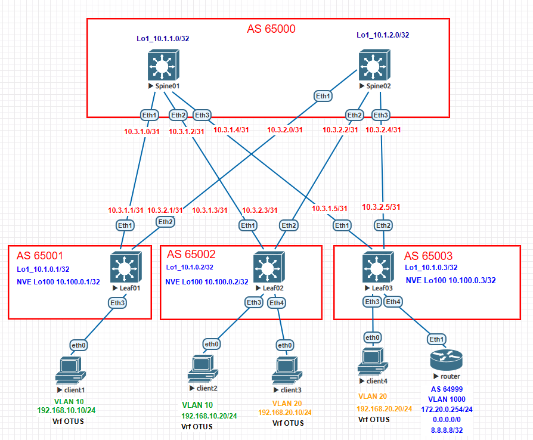

# Домашнее задание №6

## Overlay. VxLAN EVPN L3

### Задача:

- Анонсировать суммарные префиксы клиентов в Overlay сети
- Настроить маршрутизацию между клиентами через суммарный префикс
- Проверить связанность между клиентами

## Выполнение:

### Схема сети 



### Конфигурация оборудования

- #### [Leaf01](cfg/Leaf01.conf)

```
vrf instance OTUS

interface Ethernet3
   description to-client
   switchport access vlan 10

interface Vlan10
   vrf OTUS
   ip address virtual 192.168.10.254/24

interface Vxlan1
   vxlan source-interface Loopback100
   vxlan udp-port 4789
   vxlan vlan 10 vni 10010
   vxlan vrf OTUS vni 999

ip routing vrf OTUS

router bgp 65001

   vrf OTUS
      rd 65001:999
      route-target import evpn 999:999
      route-target export evpn 999:999

```

- #### [Leaf02](cfg/Leaf02.conf)

```
vrf instance OTUS

interface Ethernet3
   switchport access vlan 10

interface Ethernet4
   switchport access vlan 20


interface Vlan10
   vrf OTUS
   ip address virtual 192.168.10.254/24

interface Vlan20
   vrf OTUS
   ip address virtual 192.168.20.254/24

interface Vxlan1
   vxlan source-interface Loopback100
   vxlan udp-port 4789
   vxlan vlan 10 vni 10010
   vxlan vlan 20 vni 10020
   vxlan vrf OTUS vni 999

router bgp 65002

   vlan 10
      rd 65002:10010
      route-target both 10:10010
      redistribute learned

   vlan 20
      rd 65002:10020
      route-target both 20:10020
      redistribute learned


   vrf OTUS
      rd 65002:999
      route-target import evpn 999:999
      route-target export evpn 999:999
```

- #### [Leaf03](cfg/Leaf03.conf)

```

vrf instance OTUS

interface Ethernet3
   switchport access vlan 20

interface Ethernet4
   description to_router
   switchport trunk allowed vlan 1000
   switchport mode trunk


interface Vlan20
   vrf OTUS
   ip address virtual 192.168.20.254/24

interface Vlan1000
   description to_router
   vrf OTUS
   ip address 172.20.0.3/24


interface Vxlan1
   vxlan source-interface Loopback100
   vxlan udp-port 4789
   vxlan vlan 20 vni 10020
   vxlan vrf OTUS vni 999


ip routing vrf OTUS

router bgp 65003

   vlan 20
      rd 65003:10020
      route-target both 20:10020
      redistribute learned


   vrf OTUS
      rd 65003:999
      route-target import evpn 999:999
      route-target export evpn 999:999
      neighbor 172.20.0.254 remote-as 64999
      redistribute connected
      !
      address-family ipv4
         neighbor 172.20.0.254 activate


```
- #### [router](cfg/router.conf)

```

vlan 1000

interface Ethernet1
   description to_leaf03
   switchport trunk allowed vlan 1000
   switchport mode trunk

interface Ethernet2

interface Ethernet3

interface Loopback0
   ip address 10.200.0.1/32

interface Loopback1
   ip address 8.8.8.8/32

interface Loopback2
   ip address 8.8.4.4/32

interface Vlan1000
   description to_leaf03
   ip address 172.20.0.254/24

ip routing

ip route 0.0.0.0/0 Null0

router bgp 64999
   router-id 10.200.0.1
   neighbor 172.20.0.3 remote-as 65003
   neighbor 172.20.0.3 send-community
   redistribute connected
   redistribute static

   address-family ipv4
      neighbor 172.20.0.3 activate
      network 8.8.8.8/32


```

- #### [Spine01](cfg/Spine01.conf)

- #### [Spine02](cfg/Spine02.conf)
---

### Проверка связанности клиентов по L3

- #### Leaf01
```
Leaf01#sh ip route vrf OTUS

VRF: OTUS
Codes: C - connected, S - static, K - kernel,
       O - OSPF, IA - OSPF inter area, E1 - OSPF external type 1,
       E2 - OSPF external type 2, N1 - OSPF NSSA external type 1,
       N2 - OSPF NSSA external type2, B - Other BGP Routes,
       B I - iBGP, B E - eBGP, R - RIP, I L1 - IS-IS level 1,
       I L2 - IS-IS level 2, O3 - OSPFv3, A B - BGP Aggregate,
       A O - OSPF Summary, NG - Nexthop Group Static Route,
       V - VXLAN Control Service, M - Martian,
       DH - DHCP client installed default route,
       DP - Dynamic Policy Route, L - VRF Leaked,
       G  - gRIBI, RC - Route Cache Route

Gateway of last resort:
 B E      0.0.0.0/0 [200/0] via VTEP 10.100.0.3 VNI 999 router-mac 50:00:00:15:f4:e8 local-interface Vxlan1

 B E      8.8.4.4/32 [200/0] via VTEP 10.100.0.3 VNI 999 router-mac 50:00:00:15:f4:e8 local-interface Vxlan1
 B E      8.8.8.8/32 [200/0] via VTEP 10.100.0.3 VNI 999 router-mac 50:00:00:15:f4:e8 local-interface Vxlan1
 B E      10.200.0.1/32 [200/0] via VTEP 10.100.0.3 VNI 999 router-mac 50:00:00:15:f4:e8 local-interface Vxlan1
 B E      172.20.0.0/24 [200/0] via VTEP 10.100.0.3 VNI 999 router-mac 50:00:00:15:f4:e8 local-interface Vxlan1
 B E      192.168.10.20/32 [200/0] via VTEP 10.100.0.2 VNI 999 router-mac 50:00:00:03:37:66 local-interface Vxlan1
 C        192.168.10.0/24 is directly connected, Vlan10
 B E      192.168.20.10/32 [200/0] via VTEP 10.100.0.2 VNI 999 router-mac 50:00:00:03:37:66 local-interface Vxlan1
 B E      192.168.20.20/32 [200/0] via VTEP 10.100.0.3 VNI 999 router-mac 50:00:00:15:f4:e8 local-interface Vxlan1
 B E      192.168.20.0/24 [200/0] via VTEP 10.100.0.3 VNI 999 router-mac 50:00:00:15:f4:e8 local-interface Vxlan1

```
```
Leaf01#sh bgp evpn route-type ip-prefix ipv4
BGP routing table information for VRF default
Router identifier 10.1.0.1, local AS number 65001
Route status codes: * - valid, > - active, S - Stale, E - ECMP head, e - ECMP
                    c - Contributing to ECMP, % - Pending BGP convergence
Origin codes: i - IGP, e - EGP, ? - incomplete
AS Path Attributes: Or-ID - Originator ID, C-LST - Cluster List, LL Nexthop - Link Local Nexthop

          Network                Next Hop              Metric  LocPref Weight  Path
 * >Ec    RD: 65003:999 ip-prefix 0.0.0.0/0
                                 10.100.0.3            -       100     0       65000 65003 64999 ?
 *  ec    RD: 65003:999 ip-prefix 0.0.0.0/0
                                 10.100.0.3            -       100     0       65000 65003 64999 ?
 * >Ec    RD: 65003:999 ip-prefix 8.8.4.4/32
                                 10.100.0.3            -       100     0       65000 65003 64999 i
 *  ec    RD: 65003:999 ip-prefix 8.8.4.4/32
                                 10.100.0.3            -       100     0       65000 65003 64999 i
 * >Ec    RD: 65003:999 ip-prefix 8.8.8.8/32
                                 10.100.0.3            -       100     0       65000 65003 64999 i
 *  ec    RD: 65003:999 ip-prefix 8.8.8.8/32
                                 10.100.0.3            -       100     0       65000 65003 64999 i
 * >Ec    RD: 65003:999 ip-prefix 10.200.0.1/32
                                 10.100.0.3            -       100     0       65000 65003 64999 i
 *  ec    RD: 65003:999 ip-prefix 10.200.0.1/32
                                 10.100.0.3            -       100     0       65000 65003 64999 i
 * >Ec    RD: 65003:999 ip-prefix 172.20.0.0/24
                                 10.100.0.3            -       100     0       65000 65003 i
 *  ec    RD: 65003:999 ip-prefix 172.20.0.0/24
                                 10.100.0.3            -       100     0       65000 65003 i
 * >Ec    RD: 65003:999 ip-prefix 192.168.20.0/24
                                 10.100.0.3            -       100     0       65000 65003 i
 *  ec    RD: 65003:999 ip-prefix 192.168.20.0/24
                                 10.100.0.3            -       100     0       65000 65003 i
```
```
Leaf01#sh interfaces vxlan 1
Vxlan1 is up, line protocol is up (connected)
  Hardware is Vxlan
  Source interface is Loopback100 and is active with 10.100.0.1
  Listening on UDP port 4789
  Replication/Flood Mode is headend with Flood List Source: EVPN
  Remote MAC learning via EVPN
  VNI mapping to VLANs
  Static VLAN to VNI mapping is
    [10, 10010]
  Dynamic VLAN to VNI mapping for 'evpn' is
    [4094, 999]
  Note: All Dynamic VLANs used by VCS are internal VLANs.
        Use 'show vxlan vni' for details.
  Static VRF to VNI mapping is
   [OTUS, 999]
  Headend replication flood vtep list is:
    10 10.100.0.2
  Shared Router MAC is 0000.0000.0000
```
```
Leaf01#show vxlan vni
VNI to VLAN Mapping for Vxlan1
VNI         VLAN       Source       Interface       802.1Q Tag
----------- ---------- ------------ --------------- ----------
10010       10         static       Ethernet3       untagged
                                    Vxlan1          10

VNI to dynamic VLAN Mapping for Vxlan1
VNI       VLAN       VRF        Source
--------- ---------- ---------- ------------
999       4094       OTUS       evpn


```

- #### Leaf02
```
Leaf02#sh ip route vrf OTUS

VRF: OTUS
Codes: C - connected, S - static, K - kernel,
       O - OSPF, IA - OSPF inter area, E1 - OSPF external type 1,
       E2 - OSPF external type 2, N1 - OSPF NSSA external type 1,
       N2 - OSPF NSSA external type2, B - Other BGP Routes,
       B I - iBGP, B E - eBGP, R - RIP, I L1 - IS-IS level 1,
       I L2 - IS-IS level 2, O3 - OSPFv3, A B - BGP Aggregate,
       A O - OSPF Summary, NG - Nexthop Group Static Route,
       V - VXLAN Control Service, M - Martian,
       DH - DHCP client installed default route,
       DP - Dynamic Policy Route, L - VRF Leaked,
       G  - gRIBI, RC - Route Cache Route

Gateway of last resort:
 B E      0.0.0.0/0 [200/0] via VTEP 10.100.0.3 VNI 999 router-mac 50:00:00:15:f4:e8 local-interface Vxlan1

 B E      8.8.4.4/32 [200/0] via VTEP 10.100.0.3 VNI 999 router-mac 50:00:00:15:f4:e8 local-interface Vxlan1
 B E      8.8.8.8/32 [200/0] via VTEP 10.100.0.3 VNI 999 router-mac 50:00:00:15:f4:e8 local-interface Vxlan1
 B E      10.200.0.1/32 [200/0] via VTEP 10.100.0.3 VNI 999 router-mac 50:00:00:15:f4:e8 local-interface Vxlan1
 B E      172.20.0.0/24 [200/0] via VTEP 10.100.0.3 VNI 999 router-mac 50:00:00:15:f4:e8 local-interface Vxlan1
 B E      192.168.10.10/32 [200/0] via VTEP 10.100.0.1 VNI 999 router-mac 50:00:00:d5:5d:c0 local-interface Vxlan1
 C        192.168.10.0/24 is directly connected, Vlan10
 B E      192.168.20.20/32 [200/0] via VTEP 10.100.0.3 VNI 999 router-mac 50:00:00:15:f4:e8 local-interface Vxlan1
 C        192.168.20.0/24 is directly connected, Vlan20
```
```
Leaf02#sh bgp evpn route-type ip-prefix ipv4
BGP routing table information for VRF default
Router identifier 10.1.0.2, local AS number 65002
Route status codes: * - valid, > - active, S - Stale, E - ECMP head, e - ECMP
                    c - Contributing to ECMP, % - Pending BGP convergence
Origin codes: i - IGP, e - EGP, ? - incomplete
AS Path Attributes: Or-ID - Originator ID, C-LST - Cluster List, LL Nexthop - Link Local Nexthop

          Network                Next Hop              Metric  LocPref Weight  Path
 * >Ec    RD: 65003:999 ip-prefix 0.0.0.0/0
                                 10.100.0.3            -       100     0       65000 65003 64999 ?
 *  ec    RD: 65003:999 ip-prefix 0.0.0.0/0
                                 10.100.0.3            -       100     0       65000 65003 64999 ?
 * >Ec    RD: 65003:999 ip-prefix 8.8.4.4/32
                                 10.100.0.3            -       100     0       65000 65003 64999 i
 *  ec    RD: 65003:999 ip-prefix 8.8.4.4/32
                                 10.100.0.3            -       100     0       65000 65003 64999 i
 * >Ec    RD: 65003:999 ip-prefix 8.8.8.8/32
                                 10.100.0.3            -       100     0       65000 65003 64999 i
 *  ec    RD: 65003:999 ip-prefix 8.8.8.8/32
                                 10.100.0.3            -       100     0       65000 65003 64999 i
 * >Ec    RD: 65003:999 ip-prefix 10.200.0.1/32
                                 10.100.0.3            -       100     0       65000 65003 64999 i
 *  ec    RD: 65003:999 ip-prefix 10.200.0.1/32
                                 10.100.0.3            -       100     0       65000 65003 64999 i
 * >Ec    RD: 65003:999 ip-prefix 172.20.0.0/24
                                 10.100.0.3            -       100     0       65000 65003 i
 *  ec    RD: 65003:999 ip-prefix 172.20.0.0/24
                                 10.100.0.3            -       100     0       65000 65003 i
 * >Ec    RD: 65003:999 ip-prefix 192.168.20.0/24
                                 10.100.0.3            -       100     0       65000 65003 i
 *  ec    RD: 65003:999 ip-prefix 192.168.20.0/24
                                 10.100.0.3            -       100     0       65000 65003 i
```
```
Leaf02#sh interfaces vxlan 1
Vxlan1 is up, line protocol is up (connected)
  Hardware is Vxlan
  Source interface is Loopback100 and is active with 10.100.0.2
  Listening on UDP port 4789
  Replication/Flood Mode is headend with Flood List Source: EVPN
  Remote MAC learning via EVPN
  VNI mapping to VLANs
  Static VLAN to VNI mapping is
    [10, 10010]       [20, 10020]
  Dynamic VLAN to VNI mapping for 'evpn' is
    [4094, 999]
  Note: All Dynamic VLANs used by VCS are internal VLANs.
        Use 'show vxlan vni' for details.
  Static VRF to VNI mapping is
   [OTUS, 999]
  Headend replication flood vtep list is:
    10 10.100.0.1
    20 10.100.0.3
  Shared Router MAC is 0000.0000.0000
```
```
Leaf02#show vxlan vni
VNI to VLAN Mapping for Vxlan1
VNI         VLAN       Source       Interface       802.1Q Tag
----------- ---------- ------------ --------------- ----------
10010       10         static       Ethernet3       untagged
                                    Vxlan1          10
10020       20         static       Ethernet4       untagged
                                    Vxlan1          20

VNI to dynamic VLAN Mapping for Vxlan1
VNI       VLAN       VRF        Source
--------- ---------- ---------- ------------
999       4094       OTUS       evpn
```

- #### Leaf03
```
Leaf03#sh ip route vrf OTUS

VRF: OTUS
Codes: C - connected, S - static, K - kernel,
       O - OSPF, IA - OSPF inter area, E1 - OSPF external type 1,
       E2 - OSPF external type 2, N1 - OSPF NSSA external type 1,
       N2 - OSPF NSSA external type2, B - Other BGP Routes,
       B I - iBGP, B E - eBGP, R - RIP, I L1 - IS-IS level 1,
       I L2 - IS-IS level 2, O3 - OSPFv3, A B - BGP Aggregate,
       A O - OSPF Summary, NG - Nexthop Group Static Route,
       V - VXLAN Control Service, M - Martian,
       DH - DHCP client installed default route,
       DP - Dynamic Policy Route, L - VRF Leaked,
       G  - gRIBI, RC - Route Cache Route

Gateway of last resort:
 B E      0.0.0.0/0 [200/0] via 172.20.0.254, Vlan1000

 B E      8.8.4.4/32 [200/0] via 172.20.0.254, Vlan1000
 B E      8.8.8.8/32 [200/0] via 172.20.0.254, Vlan1000
 B E      10.200.0.1/32 [200/0] via 172.20.0.254, Vlan1000
 C        172.20.0.0/24 is directly connected, Vlan1000
 B E      192.168.10.10/32 [200/0] via VTEP 10.100.0.1 VNI 999 router-mac 50:00:00:d5:5d:c0 local-interface Vxlan1
 B E      192.168.10.20/32 [200/0] via VTEP 10.100.0.2 VNI 999 router-mac 50:00:00:03:37:66 local-interface Vxlan1
 B E      192.168.20.10/32 [200/0] via VTEP 10.100.0.2 VNI 999 router-mac 50:00:00:03:37:66 local-interface Vxlan1
 C        192.168.20.0/24 is directly connected, Vlan20
```

```
Leaf03#sh bgp evpn route-type ip-prefix ipv4
BGP routing table information for VRF default
Router identifier 10.1.0.3, local AS number 65003
Route status codes: * - valid, > - active, S - Stale, E - ECMP head, e - ECMP
                    c - Contributing to ECMP, % - Pending BGP convergence
Origin codes: i - IGP, e - EGP, ? - incomplete
AS Path Attributes: Or-ID - Originator ID, C-LST - Cluster List, LL Nexthop - Link Local Nexthop

          Network                Next Hop              Metric  LocPref Weight  Path
 * >      RD: 65003:999 ip-prefix 0.0.0.0/0
                                 -                     -       100     0       64999 ?
 * >      RD: 65003:999 ip-prefix 8.8.4.4/32
                                 -                     -       100     0       64999 i
 * >      RD: 65003:999 ip-prefix 8.8.8.8/32
                                 -                     -       100     0       64999 i
 * >      RD: 65003:999 ip-prefix 10.200.0.1/32
                                 -                     -       100     0       64999 i
 * >      RD: 65003:999 ip-prefix 172.20.0.0/24
                                 -                     -       -       0       i
 *        RD: 65003:999 ip-prefix 172.20.0.0/24
                                 -                     -       100     0       64999 i
 * >      RD: 65003:999 ip-prefix 192.168.20.0/24
 
```
```                                -                     -       -       0       i
Leaf03#sh interfaces vxlan 1
Vxlan1 is up, line protocol is up (connected)
  Hardware is Vxlan
  Source interface is Loopback100 and is active with 10.100.0.3
  Listening on UDP port 4789
  Replication/Flood Mode is headend with Flood List Source: EVPN
  Remote MAC learning via EVPN
  VNI mapping to VLANs
  Static VLAN to VNI mapping is
    [20, 10020]
  Dynamic VLAN to VNI mapping for 'evpn' is
    [4094, 999]
  Note: All Dynamic VLANs used by VCS are internal VLANs.
        Use 'show vxlan vni' for details.
  Static VRF to VNI mapping is
   [OTUS, 999]
  Headend replication flood vtep list is:
    20 10.100.0.2
  Shared Router MAC is 0000.0000.0000
```
```
Leaf03#show vxlan vni
VNI to VLAN Mapping for Vxlan1
VNI         VLAN       Source       Interface       802.1Q Tag
----------- ---------- ------------ --------------- ----------
10020       20         static       Ethernet3       untagged
                                    Vxlan1          20

VNI to dynamic VLAN Mapping for Vxlan1
VNI       VLAN       VRF        Source
--------- ---------- ---------- ------------
999       4094       OTUS       evpn
```

- #### client-1

```
VPCS> ping 192.168.10.20

84 bytes from 192.168.10.20 icmp_seq=1 ttl=64 time=99.035 ms
84 bytes from 192.168.10.20 icmp_seq=2 ttl=64 time=13.371 ms
84 bytes from 192.168.10.20 icmp_seq=3 ttl=64 time=12.911 ms
84 bytes from 192.168.10.20 icmp_seq=4 ttl=64 time=11.676 ms
84 bytes from 192.168.10.20 icmp_seq=5 ttl=64 time=27.180 ms

VPCS> ping 192.168.20.10

84 bytes from 192.168.20.10 icmp_seq=1 ttl=62 time=93.418 ms
84 bytes from 192.168.20.10 icmp_seq=2 ttl=62 time=17.728 ms
84 bytes from 192.168.20.10 icmp_seq=3 ttl=62 time=16.880 ms
84 bytes from 192.168.20.10 icmp_seq=4 ttl=62 time=16.689 ms
84 bytes from 192.168.20.10 icmp_seq=5 ttl=62 time=15.655 ms

VPCS> ping 192.168.20.20

84 bytes from 192.168.20.20 icmp_seq=1 ttl=62 time=43.569 ms
84 bytes from 192.168.20.20 icmp_seq=2 ttl=62 time=12.256 ms
84 bytes from 192.168.20.20 icmp_seq=3 ttl=62 time=11.606 ms
84 bytes from 192.168.20.20 icmp_seq=4 ttl=62 time=14.202 ms
84 bytes from 192.168.20.20 icmp_seq=5 ttl=62 time=13.400 ms

VPCS> ping 8.8.8.8

84 bytes from 8.8.8.8 icmp_seq=1 ttl=62 time=41.188 ms
84 bytes from 8.8.8.8 icmp_seq=2 ttl=62 time=17.969 ms
84 bytes from 8.8.8.8 icmp_seq=3 ttl=62 time=15.854 ms
84 bytes from 8.8.8.8 icmp_seq=4 ttl=62 time=18.768 ms
84 bytes from 8.8.8.8 icmp_seq=5 ttl=62 time=14.239 ms

```

- #### client-4

```
VPCS> ping 192.168.10.10

84 bytes from 192.168.10.10 icmp_seq=1 ttl=62 time=22.067 ms
84 bytes from 192.168.10.10 icmp_seq=2 ttl=62 time=12.046 ms
84 bytes from 192.168.10.10 icmp_seq=3 ttl=62 time=11.911 ms
84 bytes from 192.168.10.10 icmp_seq=4 ttl=62 time=13.734 ms
84 bytes from 192.168.10.10 icmp_seq=5 ttl=62 time=12.512 ms

VPCS> ping 192.168.10.20

84 bytes from 192.168.10.20 icmp_seq=1 ttl=62 time=29.869 ms
84 bytes from 192.168.10.20 icmp_seq=2 ttl=62 time=13.546 ms
84 bytes from 192.168.10.20 icmp_seq=3 ttl=62 time=13.521 ms
84 bytes from 192.168.10.20 icmp_seq=4 ttl=62 time=12.505 ms
84 bytes from 192.168.10.20 icmp_seq=5 ttl=62 time=11.829 ms

VPCS> ping 192.168.20.10

84 bytes from 192.168.20.10 icmp_seq=1 ttl=64 time=13.342 ms
84 bytes from 192.168.20.10 icmp_seq=2 ttl=64 time=11.753 ms
84 bytes from 192.168.20.10 icmp_seq=3 ttl=64 time=11.165 ms
84 bytes from 192.168.20.10 icmp_seq=4 ttl=64 time=13.019 ms
84 bytes from 192.168.20.10 icmp_seq=5 ttl=64 time=13.340 ms

VPCS> ping 8.8.8.8

84 bytes from 8.8.8.8 icmp_seq=1 ttl=63 time=8.559 ms
84 bytes from 8.8.8.8 icmp_seq=2 ttl=63 time=9.532 ms
84 bytes from 8.8.8.8 icmp_seq=3 ttl=63 time=7.365 ms
84 bytes from 8.8.8.8 icmp_seq=4 ttl=63 time=7.573 ms
84 bytes from 8.8.8.8 icmp_seq=5 ttl=63 time=7.570 ms


```

